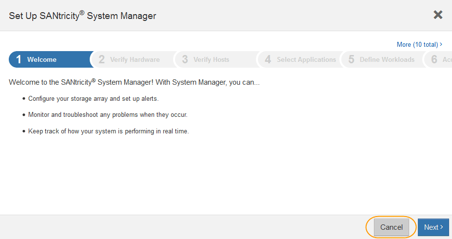
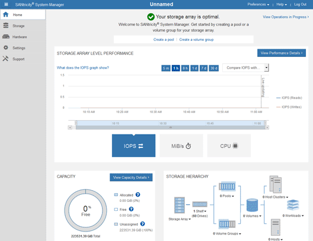

= Set up and access SANtricity System Manager
:icons: font
:imagesdir: ../media/

[.lead]
You might need to access SANtricity System Manager on the storage controller to monitor the hardware in the storage controller shelf or to configure E-Series AutoSupport.

.What you'll need

* You are using a xref:../admin/web-browser-requirements.adoc[supported web browser].
* To access SANtricity System Manager through Grid Manager, you must have installed StorageGRID, and you must have the Storage Appliance Administrator permission or Root Access permission.
* To access SANtricity System Manager using the StorageGRID Appliance Installer, you must have the SANtricity System Manager administrator username and password.
* To access SANtricity System Manager directly using a web browser, you must have the SANtricity System Manager administrator username and password.

NOTE: You must have SANtricity firmware 8.70 (11.70) or higher to access SANtricity System Manager using the Grid Manager or the StorageGRID Appliance Installer. You can check your firmware version by using the StorageGRID Appliance Installer and selecting *Help* > *About*.

IMPORTANT: Accessing SANtricity System Manager from the Grid Manager or from the Appliance Installer is generally meant only for monitoring your hardware and configuring E-Series AutoSupport. Many features and operations within SANtricity System Manager such as upgrading firmware do not apply to monitoring your StorageGRID appliance. To avoid issues, always follow the hardware installation and maintenance instructions for your appliance.

.About this task

There are three ways to access SANtricity System Manager, depending upon what stage of the installation and configuration process you are in:

* If the appliance has not yet been deployed as a node in your StorageGRID system, you should use the Advanced tab in the StorageGRID Appliance Installer.
+
NOTE: Once the node is deployed, you can no longer use the StorageGRID Appliance Installer to access SANtricity System Manager.

* If the appliance has been deployed as a node in your StorageGRID system, use the SANtricity System Manager tab on the Nodes page in Grid Manager.
* If you cannot use the StorageGRID Appliance Installer or Grid Manager, you can access SANtricity System Manager directly using a web browser connected to the management port.

This procedure includes steps for your initial access to SANtricity System Manager. If you have already set up SANtricity System Manager, go to the  <<config_hardware_alerts_sg6000,configure hardware alerts step>>.

NOTE: Using either the Grid Manager or the StorageGRID Appliance Installer enables you to access SANtricity System Manager without having to configure or connect the management port of the appliance.

You use SANtricity System Manager to monitor the following:

* Performance data such as storage array level performance, I/O latency, CPU utilization, and throughput
* Hardware component status
* Support functions including viewing diagnostic data

You can use SANtricity System Manager to configure the following settings:

* Email alerts, SNMP alerts, or syslog alerts for the components in the storage controller shelf
* E-Series AutoSupport settings for the components in the storage controller shelf.
+
For additional details on E-Series AutoSupport, see the http://mysupport.netapp.com/info/web/ECMP1658252.html[NetApp E-Series Systems Documentation Site^].

* Drive Security keys, which are needed to unlock secured drives (this step is required if the Drive Security feature is enabled)
* Administrator password for accessing SANtricity System Manager

.Steps

. Use the StorageGRID Appliance Installer and select *Advanced* > *SANtricity System Manager*

+
NOTE: If the StorageGRID Appliance Installer is not available or the login page does not appear, you must use the xref:setting-ip-addresses-for-storage-controllers-using-storagegrid-appliance-installer.adoc[IP addresses for the storage controllers]. Access SANtricity System Manager by browsing to the storage controller IP.

. Set or enter the administrator password.
+
SANtricity System Manager uses a single administrator password that is shared among all users.
+

. Select *Cancel* to close the wizard.
+
IMPORTANT: Do not complete the Set Up wizard for a StorageGRID appliance.
+

. [[config_hardware_alerts_sg6000, start=4]]Configure hardware alerts.
 .. Select *Help* to access the online help for SANtricity System Manager.
 .. Use the *Settings* > *Alerts* section of the online help to learn about alerts.
 .. Follow the "`How To`" instructions to set up email alerts, SNMP alerts, or syslog alerts.
. Manage AutoSupport for the components in the storage controller shelf.
 .. Select *Help* to access the online help for SANtricity System Manager.
 .. Use the *SUPPORT* > *Support Center* section of the online help to learn about the AutoSupport feature.
 .. Follow the "`How To`" instructions to manage AutoSupport.
+
For specific instructions on configuring a StorageGrid proxy for sending E-Series AutoSupport messages without using the management port, go to the xref:../admin/configuring-storage-proxy-settings.adoc[instructions for configuring storage proxy settings].

. If the Drive Security feature is enabled for the appliance, create and manage the security key.
 .. Select *Help* to access the online help for SANtricity System Manager.
 .. Use the *Settings* > *System* > *Security key management* section of the online help to learn about Drive Security.
 .. Follow the "`How To`" instructions to create and manage the security key.
. Optionally, change the administrator password.
 .. Select *Help* to access the online help for SANtricity System Manager.
 .. Use the *Home* > *Storage array administration* section of the online help to learn about the administrator password.
 .. Follow the "`How To`" instructions to change the password.