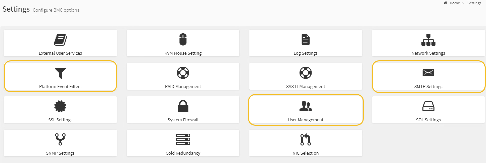

= Setting up email notifications for alerts
:icons: font
:imagesdir: ../media/

[.lead]
If you want email notifications to be sent when alerts occur, you must use the BMC interface to configure SMTP settings, users, LAN destinations, alert policies, and event filters.

.What you'll need

You know how to access the BMC dashboard.

.About this task

In the BMC interface, you use the *SMTP Settings*, *User Management*, and *Platform Event Filters* options on the Settings page to configure email notifications.

.Steps

. Configure the SMTP settings.
 .. Select *Settings* > *SMTP Settings*.
 .. For Sender Email ID, enter a valid email address.
+
This email address is provided as the From address when the BMC sends email.
. Set up users to receive alerts.
 .. From the BMC dashboard, select *Settings* > *User Management*.
 .. Add at least one user to receive alert notifications.
+
The email address you configure for a user is the address the BMC sends alert notifications to. For example, you could add a generic user, such as "`notification-user,`" and use the email address of a technical support team email distribution list.
. Configure the LAN destination for alerts.
 .. Select *Settings* > *Platform Event Filters* > *LAN Destinations*.
 .. Configure at least one LAN destination.
  *** Select *Email* as the Destination Type.
  *** For BMC Username, select a user name that you added earlier.
  *** If you added multiple users and want all of them to receive notification emails, you must add a LAN Destination for each user.
 .. Send a test alert.
. Configure alert policies so you can define when and where the BMC sends alerts.
 .. Select *Settings* > *Platform Event Filters* > *Alert Policies*.
 .. Configure at least one alert policy for each LAN destination.
  *** For Policy Group Number, select *1*.
  *** For Policy Action, select *Always send alert to this destination*.
  *** For LAN Channel, select *1*.
  *** In the Destination Selector, select the LAN destination for the policy.
. Configure event filters to direct alerts for different event types to the appropriate users.
 .. Select *Settings* > *Platform Event Filters* > *Event Filters*.
 .. For Alert Policy Group Number, enter *1*.
 .. Create filters for every event you want the Alert Policy Group to be notified about.
  *** You can create event filters for power actions, specific sensor events, or all events.
  *** If you are uncertain which events to monitor, select *All Sensors* for Sensor Type and *All Events* for Event Options. If you receive unwanted notifications, you can change your selections later.
