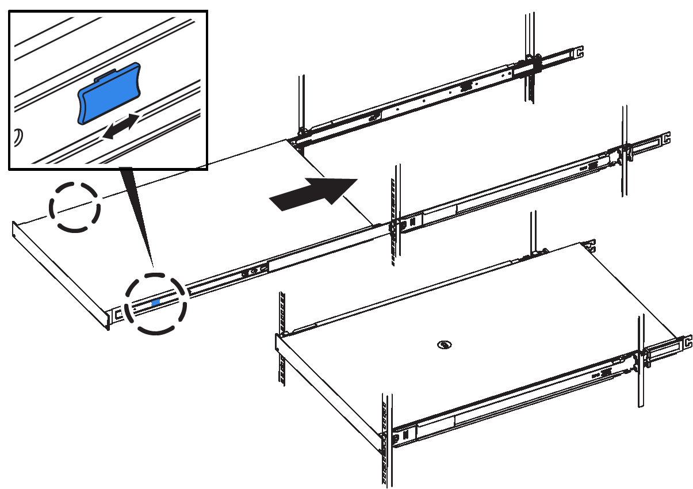
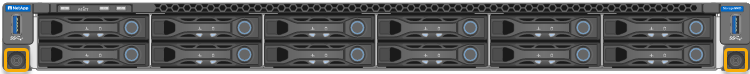

= SG6000-CN: Installing into a cabinet or rack
:icons: font
:imagesdir: ../media/

[.lead]
You must install a set of rails for the SG6000-CN controller in your cabinet or rack, and then slide the controller onto the rails.

.What you'll need

* You have reviewed the Safety Notices document included in the box, and understand the precautions for moving and installing hardware.
* You have the instructions packaged with the rail kit.
* You have installed the E2860 controller shelf and drives or the EF570 controller shelf.

.Steps

. Carefully follow the instructions for the rail kit to install the rails in your cabinet or rack.
. On the two rails installed in the cabinet or rack, extend the movable parts of the rails until you hear a click.
+
image::../media/rails_extended_out.gif[SG6000 Rails]

. Insert the SG6000-CN controller into the rails.
. Slide the controller into the cabinet or rack.
+
When you cannot move the controller any further, pull the blue latches on both sides of the chassis to slide the controller all the way in.
+

+
NOTE: Do not attach the front bezel until after you power on the controller.

. Tighten the captive screws on the controller front panel to secure the controller in the rack.
+

