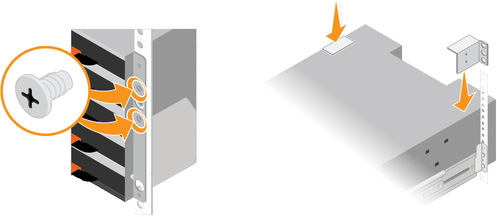

= SG6060: Installing 60-drive shelves into a cabinet or rack
:icons: font
:imagesdir: ../media/

[.lead]
You must install a set of rails for the E2860 controller shelf in your cabinet or rack, and then slide the controller shelf onto the rails. If you are installing 60-drive expansion shelves, the same procedure applies.

.What you'll need

* You have reviewed the Safety Notices document included in the box, and understand the precautions for moving and installing hardware.
* You have the instructions packaged with the rail kit.

CAUTION: Each 60-drive shelf weighs approximately 132 lb (60 kg) without drives installed. Four people or a mechanized lift are required to safely move the shelf.

CAUTION: To avoid damaging the hardware, never move the shelf if drives are installed. You must remove all drives before moving the shelf.

CAUTION: When installing the E2860 controller shelf or optional expansion shelves, install hardware from the bottom to the top of the rack or cabinet to prevent the equipment from tipping over. To ensure that the heaviest equipment is at the bottom of the cabinet or rack, install the SG6000-CN controller above the E2860 controller shelf and expansion shelves.

IMPORTANT: Before committing to the installation, verify that the 0.5m optic cables shipped with the appliance, or cables that you supply, are long enough for the planned layout.

.Steps

. Carefully follow the instructions for the rail kit to install the rails in your cabinet or rack.
+
For square hole cabinets, you must first install the provided cage nuts to secure the front and rear of the shelf with screws.

. Remove the outer packing box for the appliance. Then, fold down the flaps on the inner box.
. If you are lifting the appliance by hand, attach the four handles to the sides of the chassis.
+
Push up on each handle until it clicks into place.
+
image::../media/lift_handles.gif[Lift Handles]

. Place the back of the shelf (the end with the connectors) on the rails.
. Supporting the shelf from the bottom, slide it into the cabinet. If you are using the handles, use the thumb latches to detach one handle at a time as you slide the shelf in.
+
To remove the handles, pull back on the release latch, push down, then pull away from the shelf.

. Secure the shelf to the front of the cabinet.
+
Insert screws into the first and third holes from the top of the shelf on both sides.

. Secure the shelf to the rear of the cabinet.
+
Place two back brackets on each side of the upper rear section of the shelf. Insert screws into the first and third holes of each bracket.
+

. Repeat these steps for any expansion shelves.
