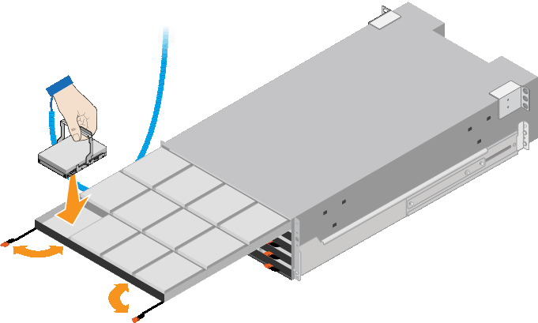

= SG6060: Installing the drives
:icons: font
:imagesdir: ../media/

[.lead]
After installing the 60-drive shelf into a cabinet or rack, you must install all 60 drives into the shelf. The shipment for the E2860 controller shelf includes two SSD drives, which you should install in the top drawer of the controller shelf. Each optional expansion shelf includes 60 HDD drives and no SSD drives.

.What you'll need

You have installed the E2860 controller shelf or optional expansion shelves (one or two) in the cabinet or rack.

CAUTION: To avoid damaging the hardware, never move the shelf if drives are installed. You must remove all drives before moving the shelf.

.Steps

. Wrap the strap end of the ESD wristband around your wrist, and secure the clip end to a metal ground to prevent static discharge.
. Remove the drives from their packaging.
. Release the levers on the top drive drawer, and slide the drawer out using the levers.
. Locate the two SSD drives.
+
NOTE: Expansion shelves do not use SSD drives.

. Raise each drive handle to a vertical position.
. Install the two SSD drives in slots 0 and 1 (the first two slots along the lefthand side of the drawer).
. Gently position each drive into its slot, and lower the raised drive handle until it clicks into place.
+

. Install 10 HDD drives into the top drawer.
. Slide the drawer back in by pushing on the center and closing both levers gently.
+
IMPORTANT: Stop pushing the drawer if you feel binding. Use the release levers at the front of the drawer to slide the drawer back out. Then, carefully reinsert the drawer into the slot.

. Repeat these steps to install HDD drives into the other four drawers.
+
IMPORTANT: You must install all 60 drives to ensure correct operation.

. Attach the front bezel to the shelf.
. If you have expansion shelves, repeat these steps to install 12 HDD drives into each drawer of each expansion shelf.
. Proceed to the instructions for installing the SG6000-CN into a cabinet or rack.
