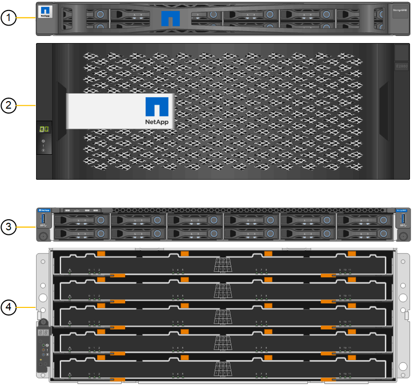
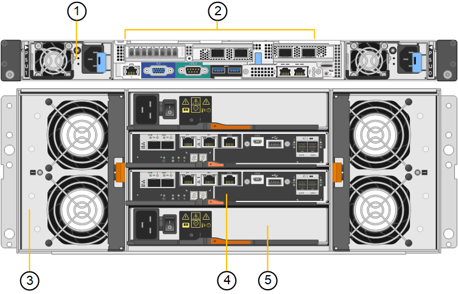
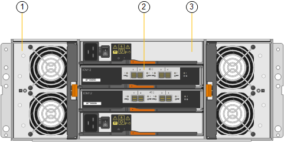

= SG6060 overview
:icons: font
:imagesdir: ../media/

[.lead]
The StorageGRIDSG6060 appliance includes a compute controller and a storage controller shelf that contains two storage controllers and 60 drives. Optionally, 60-drive expansion shelves can be added to the appliance.

== SG6060 components

The SG6060 appliance includes the following components:

[options="header"]
|===
| Component| Description
a|
Compute controller
a|
SG6000-CN controller, a one-rack unit (1U) server that includes:

* 40 cores (80 threads)
* 192 GB RAM
* Up to 4 × 25 Gbps aggregate Ethernet bandwidth
* 4 × 16 Gbps Fibre Channel (FC) interconnect
* Baseboard management controller (BMC) that simplifies hardware management
* Redundant power supplies

a|
Storage controller shelf
a|
E-Series E2860 controller shelf (storage array), a 4U shelf that includes:

* Two E-Series E2800 controllers (duplex configuration) to provide storage controller failover support
* Five-drawer drive shelf that holds sixty 3.5-inch drives (2 solid-state drives, or SSDs, and 58 NL-SAS drives)
* Redundant power supplies and fans

a|
Optional: Storage expansion shelves

*Note:* Expansion shelves can be installed during initial deployment or added later.

a|
E-Series DE460C enclosure, a 4U shelf that includes:

* Two input/output modules (IOMs)
* Five drawers, each holding 12 NL-SAS drives, for a total of 60 drives
* Redundant power supplies and fans

Each SG6060 appliance can have one or two expansion shelves for a total of 180 drives.

|===

== SG6060 diagrams

This figure shows the front of the SG6060, which includes a 1U compute controller and a 4U shelf containing two storage controllers and 60 drives in five drive drawers.

[options="header"]
|===
| Callout| Description
a|
1
a|
SG6000-CN compute controller with front bezel
a|
2
a|
E2860 controller shelf with front bezel (optional expansion shelf looks identical)
a|
3
a|
SG6000-CN compute controller with front bezel removed
a|
4
a|
E2860 controller shelf with front bezel removed (optional expansion shelf looks identical)
|===
This figure shows the back of the SG6060, including the compute and storage controllers, fans, and power supplies.

[options="header"]
|===
| Callout| Description
a|
1
a|
Power supply (1 of 2) for SG6000-CN compute controller
a|
2
a|
Connectors for SG6000-CN compute controller
a|
3
a|
Fan (1 of 2) for E2860 controller shelf
a|
4
a|
E-Series E2800 storage controller (1 of 2) and connectors
a|
5
a|
Power supply (1 of 2) for E2860 controller shelf
|===
This figure shows the back of the optional expansion shelf for the SG6060, including the input/output modules (IOMs), fans, and power supplies. Each SG6060 can be installed with one or two expansion shelves, which can be included in the initial installation or added later.

[options="header"]
|===
| Callout| Description
a|
1
a|
Fan (1 of 2) for expansion shelf
a|
2
a|
IOM (1 of 2) for expansion shelf
a|
3
a|
Power supply (1 of 2) for expansion shelf
|===
