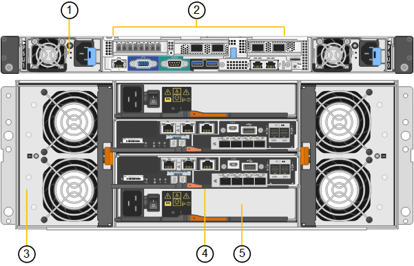

= SG6060 and SG6060X appliances
:icons: font
:imagesdir: ../media/

[.lead]
The StorageGRID SG6060 and SG6060X appliances each include a compute controller and a storage controller shelf that contains two storage controllers and 60 drives. Optionally, 60-drive expansion shelves can be added to both appliances. There are no specification or functional differences between the SG6060 and SG6060X except for the location of the interconnect ports on the storage controller.

== SG6060 and SG6060X components

The SG6060 and SG660X appliances includes the following components:

[cols="1a,2a" options="header"]
|===
| Component| Description
a|
Compute controller
a|
SG6000-CN controller, a one-rack unit (1U) server that includes:

* 40 cores (80 threads)
* 192 GB RAM
* Up to 4 × 25 Gbps aggregate Ethernet bandwidth
* 4 × 16 Gbps Fibre Channel (FC) interconnect
* Baseboard management controller (BMC) that simplifies hardware management
* Redundant power supplies

a|
Storage controller shelf
a|
E-Series E2860 controller shelf (storage array), a 4U shelf that includes:

* Two E2800 series controllers (duplex configuration) to provide storage controller failover support
** The SG6060 contains E2800A storage controllers
** The SG6060X contains E2800B storage controllers
* Five-drawer drive shelf that holds sixty 3.5-inch drives (2 solid-state drives, or SSDs, and 58 NL-SAS drives)
* Redundant power supplies and fans

a|
Optional: Storage expansion shelves

*Note:* Expansion shelves can be installed during initial deployment or added later.

a|
E-Series DE460C enclosure, a 4U shelf that includes:

* Two input/output modules (IOMs)
* Five drawers, each holding 12 NL-SAS drives, for a total of 60 drives
* Redundant power supplies and fans

Each SG6060 and SG6060X appliance can have one or two expansion shelves for a total of 180 drives.

|===

== SG6060 and 6060X diagrams

the fronts of the SG6060 and SG6060X are identical. This figure shows the front of the SG6060, which includes a 1U compute controller and a 4U shelf containing two storage controllers and 60 drives in five drive drawers.

*SG6060 front view*

image::../media/sg6060_front_view_with_and_without_bezels.gif[SG6060 Front View]

[cols="1a,2a" options="header"]
|===
| Callout| Description
a|
1
a|
SG6000-CN compute controller with front bezel
a|
2
a|
E2860 controller shelf with front bezel (optional expansion shelf appears identical)
a|
3
a|
SG6000-CN compute controller with front bezel removed
a|
4
a|
E2860 controller shelf with front bezel removed (optional expansion shelf appears identical)
|===
This figure shows the back of the SG6060, including the compute and storage controllers, fans, and power supplies.

*SG6060 rear view*

image::../media/sg6060_rear_view.gif[SG6060 Rear View]

[cols="1a,2a" options="header"]
|===
| Callout| Description
a|
1
a|
Power supply (1 of 2) for SG6000-CN compute controller
a|
2
a|
Connectors for SG6000-CN compute controller
a|
3
a|
Fan (1 of 2) for E2860 controller shelf
a|
4
a|
E-Series E2800A storage controller (1 of 2) and connectors
a|
5
a|
Power supply (1 of 2) for E2860 controller shelf
|===

*SG6060X rear view*

[cols="1a,2a" options="header"]
|===
| Callout| Description
a|
1
a|
Power supply (1 of 2) for SG6000-CN compute controller
a|
2
a|
Connectors for SG6000-CN compute controller
a|
3
a|
Fan (1 of 2) for E2860 controller shelf
a|
4
a|
E-Series E2800B storage controller (1 of 2) and connectors
a|
5
a|
Power supply (1 of 2) for E2860 controller shelf
|===
*SG6060 and SG6060X expansion shelf*

This figure shows the back of the optional expansion shelf for the SG6060 and SG6060X, including the input/output modules (IOMs), fans, and power supplies. Each SG6060 can be installed with one or two expansion shelves, which can be included in the initial installation or added later.

image::../media/de460c_expansion_shelf_rear_view.gif[Expansion Shelf Rear]

[cols="1a,2a" options="header"]
|===
| Callout| Description
a|
1
a|
Fan (1 of 2) for expansion shelf
a|
2
a|
IOM (1 of 2) for expansion shelf
a|
3
a|
Power supply (1 of 2) for expansion shelf
|===
