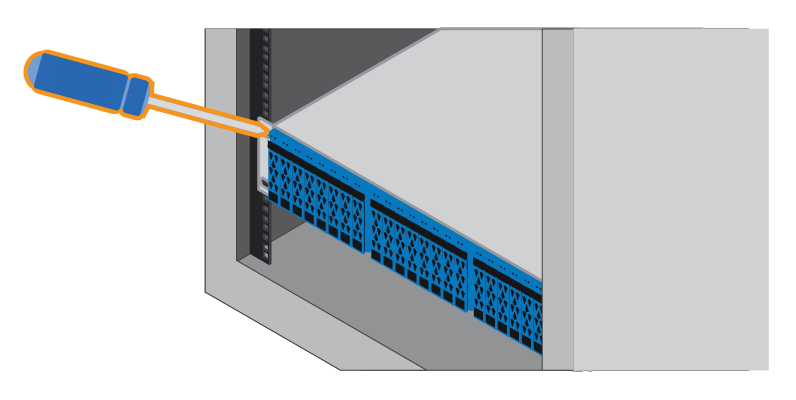
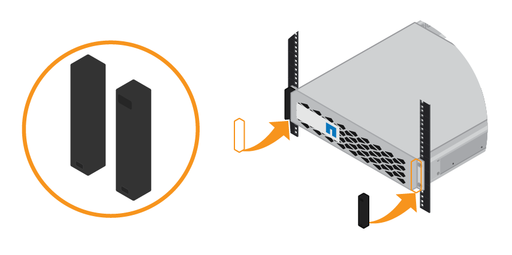

= SGF6024: Installing 24-drive shelves into a cabinet or rack
:icons: font
:imagesdir: ../media/

[.lead]
You must install a set of rails for the EF570 controller shelf in your cabinet or rack, and then slide the array onto the rails.

.What you'll need

* You have reviewed the Safety Notices document included in the box, and understand the precautions for moving and installing hardware.
* You have the instructions packaged with the rail kit.

.Steps

. Carefully follow the instructions for the rail kit to install the rails in your cabinet or rack.
+
For square hole cabinets, you must first install the provided cage nuts to secure the front and rear of the shelf with screws.

. Remove the outer packing box for the appliance. Then, fold down the flaps on the inner box.
. Place the back of the shelf (the end with the connectors) on the rails.
+
CAUTION: A fully loaded shelf weighs approximately 52 lb (24 kg). Two persons are required to safely move the enclosure.

. Carefully slide the enclosure all the way onto the rails.
+
CAUTION: You might need to adjust the rails to ensure that the enclosure slides all the way onto the rails.
+
IMPORTANT: Do not place additional equipment on the rails after you finish installing the enclosure. The rails are not designed to bear additional weight.
+
NOTE: If applicable, you might need to remove the shelf end caps or the system bezel to secure the enclosure to the rack post; if so, you need to replace the end caps or bezel when you are done.

. Secure the enclosure to the front of the cabinet or rack and rails by inserting two M5 screws through the mounting brackets (preinstalled on either side of the front of the enclosure), the holes on the rack or system cabinet, and the holes on the front of rails.
+

. Secure the enclosure to the back of the rails by inserting two M5 screws through the brackets at the enclosure and the rail kit bracket.
. If applicable, replace the shelf end caps or the system bezel.
+

