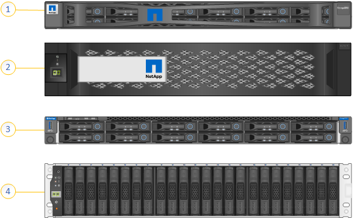
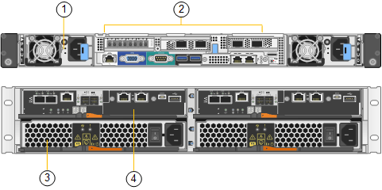

= SGF6024 overview
:icons: font
:imagesdir: ../media/

[.lead]
The StorageGRIDSGF6024 includes a compute controller and a storage controller shelf that holds 24 solid state drives.

== SGF6024 components

The SGF6024 appliance includes the following components:

[options="header"]
|===
| Component| Description
a|
Compute controller
a|
SG6000-CN controller, a one-rack unit (1U) server that includes:

* 40 cores (80 threads)
* 192 GB RAM
* Up to 4 × 25 Gbps aggregate Ethernet bandwidth
* 4 × 16 Gbps Fibre Channel (FC) interconnect
* Baseboard management controller (BMC) that simplifies hardware management
* Redundant power supplies

a|
Flash array (controller shelf)
a|
E-Series EF570 flash array (also known as a controller shelf), a 2U shelf that includes:

* Two E-Series EF570 controllers (duplex configuration) to provide storage controller failover support
* 24 solid state drives (also known as SSDs or flash drives)
* Redundant power supplies and fans

|===

== SGF6024 diagrams

This figure shows the front of the SGF6024, which includes a 1U compute controller and a 2U enclosure containing two storage controllers and 24 flash drives.

[options="header"]
|===
| Callout| Description
a|
1
a|
SG6000-CN compute controller with front bezel
a|
2
a|
EF570 flash array with front bezel
a|
3
a|
SG6000-CN compute controller with front bezel removed
a|
4
a|
EF570 flash array with front bezel removed
|===
This figure shows the back of the SGF6024, including the compute and storage controllers, fans, and power supplies.

[options="header"]
|===
| Callout| Description
a|
1
a|
Power supply (1 of 2) for SG6000-CN compute controller
a|
2
a|
Connectors for SG6000-CN compute controller
a|
3
a|
Power supply (1 of 2) for EF570 flash array
a|
4
a|
E-Series EF570 storage controller (1 of 2) and connectors
|===
