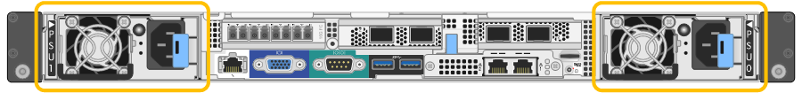

= Replacing a power supply in the SG6000-CN controller
:icons: font
:imagesdir: ../media/

[.lead]
The SG6000-CN controller has two power supplies for redundancy. If one of the power supplies fails, you must replace it as soon as possible to ensure that the compute controller has redundant power.

* You have unpacked the replacement power supply unit.
* You have physically located the controller where you are replacing the power supply in the data center.
+
xref:task_locating_the_controller_in_a_data_center.adoc[Locating the controller in a data center]

* You have confirmed that the other power supply is installed and running.

The figure shows the two power supply units for the SG6000-CN controller, which are accessible from the back of the controller.

. Unplug the power cord from the power supply.
. Lift the cam handle.
+
image::../media/lift_cam_handle_sg6000_cn_psu.gif[Lifting the cam handle to remove SG6000-CN PSU]

. Press the blue latch and pull the power supply out.
+
image::../media/remove_power_supply_sg6000_cn.gif[Removing an SG6000-CN power supply]

. Slide the replacement power supply into the chassis.
+
Ensure that the blue latch is on the right side when you slide the unit in.
+
image::../media/insert_power_supply_sg6000_cn.gif[Sliding power supply into SG6000-CN]

. Push the cam handle down to secure the power supply.
. Attach the power cord to the power supply, and ensure that the green LED comes on.
