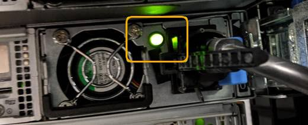

= Shutting down the SG6000-CN controller
:icons: font
:imagesdir: ../media/

[.lead]
Shut down the SG6000-CN controller to perform hardware maintenance.

* You have physically located the SG6000-CN controller requiring maintenance in the data center.
+
xref:task_locating_the_controller_in_a_data_center.adoc[Locating the controller in a data center]

* The appliance has been placed maintenance mode.
+
xref:task_placing_an_appliance_into_maintenance_mode.adoc[Placing an appliance into maintenance mode]

To prevent service interruptions, confirm that all other Storage Nodes are connected to the grid before shutting down the controller or shut down the controller during a scheduled maintenance window when periods of service disruption are normally expected. See the information about determining node connection states in the instructions for managing objects with information lifecycle management.

IMPORTANT: If you have ever used an ILM rule that creates only one copy of an object, you must shut down the controller during a scheduled maintenance window. Otherwise, you might temporarily lose access to those objects during this procedure.

See information about managing objects with information lifecycle management.

. When the appliance has been placed maintenance mode, shut down the SG6000-CN controller:
+
CAUTION:
+
You must perform a controlled shut down of the controller by entering the commands specified below. Shutting down the controller using the power switch will result in data loss.

 .. Log in to the grid node using PuTTY or another ssh client:
  ... Enter the following command: `ssh admin@grid_node_IP`
  ... Enter the password listed in the Passwords.txt file.
  ... Enter the following command to switch to root: `su -`
  ... Enter the password listed in the Passwords.txt file.
+
When you are logged in as root, the prompt changes from `$` to `#`.
 .. Shut down the SG6000-CN controller:``shutdown -h now``
+
This command might take up to 10 minutes to complete.

. Use one of the following methods to verify that the SG6000-CN controller is powered off:
 ** Look at the blue power LED on the front of the controller and confirm that it is off.
+
image::../media/sg6060_front_panel_power_led_off.jpg[SG6060 front panel power LED - off]

 ** Look at the green LEDs on both power supplies in the rear of the controller and confirm that they blink at a regular rate (approximately one blink per second).
+

 ** Use the controller BMC interface:
  ... Access the controller BMC interface.
+
xref:task_accessing_the_bmc_interface_sg6000.adoc[Accessing the BMC interface]

  ... Select *Power Control*.
  ... Verify that the Power Actions indicates that the host is currently off.
+
image::../media/bmc_power_control_page_controller_off.png[BMC Power control page - controller off]

*Related information*

xref:task_removing_the_sg6000_cn_controller_from_a_cabinet_or_rack.adoc[Removing the SG6000-CN controller from a cabinet or rack]
