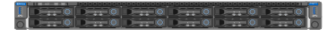
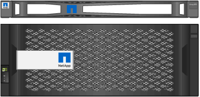
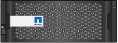
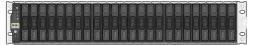
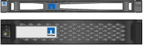

= Unpacking the boxes (SG6000)
:icons: font
:imagesdir: ../media/

[.lead]
Before installing the StorageGRID appliance, unpack all boxes and compare the contents to the items on the packing slip.

== SG6060

* *SG6000-CN controller*
+

* *E2860 controller shelf with no drives installed*
+
image::../media/de460c_table_size.gif[SG5760 4U appliance]

* *Two front bezels*
+

* *Two rail kits with instructions*
+
image::../media/rail_kit.gif[Rail kit]

* *60 drives (2 SSD and 58 NL-SAS)*
+
image::../media/sg5760_drive.gif[Drive]

* *Four handles*
+
image::../media/handles.gif[SG5760 handles]

* *Back brackets and cage nuts for square-hole rack installation*
+
image::../media/back_brackets_table_size.gif[Back brackets and cage nuts for SG5760]

== SG6060 expansion shelf

* *Expansion shelf with no drives installed*
+
image::../media/de460c_table_size.gif[SG5760 4U appliance]

* *Front bezel*
+

* *60 NL-SAS drives*
+
image::../media/sg5760_drive.gif[Drive]

* *One rail kit with instructions*
+
image::../media/rail_kit.gif[Rail kit]

* *Four handles*
+
image::../media/handles.gif[SG5760 handles]

* *Back brackets and cage nuts for square-hole rack installation*
+
image::../media/back_brackets_table_size.gif[Back brackets and cage nuts for SG5760]

== SGF6024

* *SG6000-CN controller*
+

* *EF570 flash array with 24 solid state (flash) drives installed*
+

* *Two front bezels*
+

* *Two rail kits with instructions*
+
image::../media/rail_kit.gif[Rail kit]

* *Shelf endcaps*
+

== Cables and connectors

The shipment for the StorageGRID appliance includes the following cables and connectors:

* *Four power cords for your country*
+
image::../media/power_cords.gif[Power cords]
+
Your cabinet might have special power cords that you use instead of the power cords that ship with the appliance.

* *Optical cables and SFP transceivers*
+
image::../media/fc_cable_and_sfp.gif[Optical cables and SFPs]
+
Four optical cables for the FC interconnect ports
+
Four SFP+ transceivers, which support 16-Gb/s FC

* *Optional: Two SAS cables for connecting each SG6060 expansion shelf*
+
image::../media/sas_cable.gif[SAS Cables]
