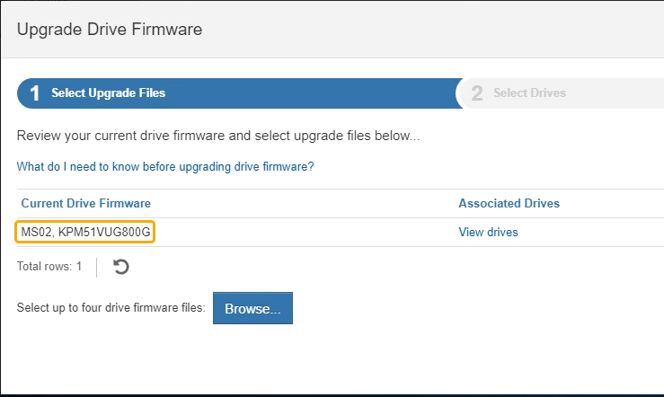
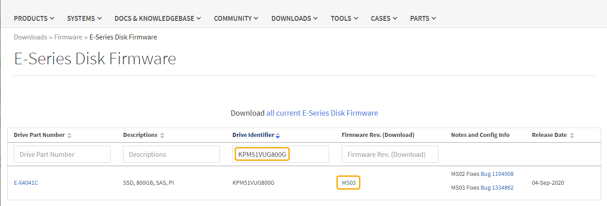

= Upgrading drive firmware using SANtricity System Manager
:icons: font
:imagesdir: ../media/

[.lead]
You upgrade your drive firmware to make sure you have all the latest features and bug fixes.

.What you'll need

* The storage appliance has an Optimal status.
* All drives have an Optimal status.
* You have the latest version of SANtricity System Manager installed that is compatible with your StorageGRID version.
* You have placed the StorageGRID appliance in maintenance mode.
+
xref:placing-appliance-into-maintenance-mode.adoc[Placing an appliance into maintenance mode]
+
NOTE: Maintenance mode interrupts the connection to the storage controller, stopping all I/O activity and placing all drives offline.
+
IMPORTANT: Do not upgrade the drive firmware on more than one StorageGRID appliance at a time. Doing so might cause data unavailability, depending on your deployment model and ILM policies.

.Steps

. Access SANtricity System Manager using one of these methods:
 ** Use the StorageGRID Appliance Installer and select *Advanced* > *SANtricity System Manager*
 ** Use the Grid Manager and select *Nodes* > `*_appliance Storage Node_*` > *SANtricity System Manager*
+
NOTE: If these options are not available or the SANtricity System Manager login page does not appear, access SANtricity System Manager by browsing to the storage controller IP: +
`*https://_Storage_Controller_IP_*`
. Enter the SANtricity System Manager administrator username and password, if required.
. Verify the drive firmware version currently installed in the storage appliance:
 .. From SANtricity System Manager, select *Support* > *Upgrade Center*.
 .. Under Drive Firmware upgrade, select *Begin Upgrade*.
+
The Upgrade Drive Firmware displays the drive firmware files currently installed.

 .. Note the current drive firmware revisions and drive identifiers in the Current Drive Firmware column.
+

+
In this example:

  *** The drive firmware revision is *MS02*.
  *** The drive identifier is *KPM51VUG800G*.

+
Select *View drives* in the Associated Drives column to display where these drives are installed in your storage appliance.

+
 .. Close the Upgrade Drive Firmware window.

. Download and prepare the available drive firmware upgrade:
 .. Under Drive Firmware upgrade, select *NetApp Support*.
 .. On the NetApp Support web site, select the *Downloads* tab, and then select *E-Series Disk Drive Firmware*.
+
The E-Series Disk Firmware page displays.

 .. Search for each *Drive Identifier* installed in your storage appliance and verify that each drive identifier has the latest firmware revision.
  *** If the firmware revision is not a link, this drive identifier has the latest firmware revision.
  *** If one or more drive part numbers are listed for a drive identifier, a firmware upgrade is available for these drives. You can select any link to download the firmware file.

 .. If a later firmware revision is listed, select the link in the Firmware Rev. (Download) column to download a `.zip` archive containing the firmware file.
 .. Extract (unzip) the drive firmware archive files you downloaded from the Support site.
. Install the drive firmware upgrade:
 .. From SANtricity System Manager, under Drive Firmware upgrade, select *Begin Upgrade*.
 .. Select *Browse*, and select the new drive firmware files that you downloaded from the Support site.
+
Drive firmware files have a filename similar to +
`D_HUC101212CSS600_30602291_MS01_2800_0002.dlp`.
+
You can select up to four drive firmware files, one at a time. If more than one drive firmware file is compatible with the same drive, you get a file conflict error. Decide which drive firmware file you want to use for the upgrade and remove the other one.

 .. Select *Next*.
+
*Select Drives* lists the drives that you can upgrade with the selected firmware files.
+
Only drives that are compatible appear.
+
The selected firmware for the drive appears in *Proposed Firmware*. If you must change this firmware, select *Back*.

 .. Select *Offline (parallel)* upgrade.
+
You can use the offline upgrade method because the appliance is in maintenance mode, where I/O activity is stopped for all drives and all volumes.

 .. In the first column of the table, select the drive or drives you want to upgrade.
+
The best practice is to upgrade all drives of the same model to the same firmware revision.

 .. Select *Start*, and confirm that you want to perform the upgrade.
+
If you need to stop the upgrade, select *Stop*. Any firmware downloads currently in progress complete. Any firmware downloads that have not started are canceled.
+
IMPORTANT: Stopping the drive firmware upgrade might result in data loss or unavailable drives.

 .. (Optional) To see a list of what was upgraded, select *Save Log*.
+
The log file is saved in the downloads folder for your browser with the name `latest-upgrade-log-timestamp.txt`.
+
If any of the following errors occur during the upgrade procedure, take the appropriate recommended action.

 ** *Failed assigned drives*
+
One reason for the failure might be that the drive does not have the appropriate signature. Make sure that the affected drive is an authorized drive. Contact technical support for more information.
+
When replacing a drive, make sure that the replacement drive has a capacity equal to or greater than the failed drive you are replacing.
+
You can replace the failed drive while the storage array is receiving I/O.

 ** *Check storage array*
  *** Make sure that an IP address has been assigned to each controller.
  *** Make sure that all cables connected to the controller are not damaged.
  *** Make sure that all cables are tightly connected.
 ** *Integrated hot spare drives*
+
This error condition must be corrected before you can upgrade the firmware.

 ** *Incomplete volume groups*
+
If one or more volume groups or disk pools are incomplete, you must correct this error condition before you can upgrade the firmware.

 ** *Exclusive operations (other than background media/parity scan) currently running on any volume groups*
+
If one or more exclusive operations are in progress, the operations must complete before the firmware can be upgraded. Use System Manager to monitor the progress of the operations.

 ** *Missing volumes*
+
You must correct the missing volume condition before the firmware can be upgraded.

 ** *Either controller in a state other than Optimal*
+
One of the storage array controllers needs attention. This condition must be corrected before the firmware can be upgraded.

 ** *Mismatched Storage Partition information between Controller Object Graphs*
+
An error occurred while validating the data on the controllers. Contact technical support to resolve this issue.

 ** *SPM Verify Database Controller check fails*
+
A storage partitions mapping database error occurred on a controller. Contact technical support to resolve this issue.

 ** *Configuration Database Validation (If supported by the storage array's controller version)*
+
A configuration database error occurred on a controller. Contact technical support to resolve this issue.

 ** *MEL Related Checks*
+
Contact technical support to resolve this issue.

 ** *More than 10 DDE Informational or Critical MEL events were reported in the last 7 days*
+
Contact technical support to resolve this issue.

 ** *More than 2 Page 2C Critical MEL Events were reported in the last 7 days*
+
Contact technical support to resolve this issue.

 ** *More than 2 Degraded Drive Channel Critical MEL events were reported in the last 7 days*
+
Contact technical support to resolve this issue.

 ** *More than 4 critical MEL entries in the last 7 days*
+
Contact technical support to resolve this issue.
. Once the upgrade operation has completed, reboot the appliance. From the StorageGRID Appliance Installer, select *Advanced* > *Reboot Controller*, and then select one of these options:
 ** Select *Reboot into StorageGRID* to reboot the controller with the node rejoining the grid. Select this option if you are done working in maintenance mode and are ready to return the node to normal operation.
 ** Select *Reboot into Maintenance Mode* to reboot the controller with the node remaining in maintenance mode. Select this option if there are additional maintenance operations you need to perform on the node before rejoining the grid.
image:../media/reboot_controller_from_maintenance_mode.png[Reboot controller in maintenance mode]
+
It can take up to 20 minutes for the appliance to reboot and rejoin the grid. To confirm that the reboot is complete and that the node has rejoined the grid, go back to the Grid Manager. The *Nodes* tab should display a normal status image:../media/icon_alert_green_checkmark.png[icon alert green checkmark] for the appliance node, indicating that no alerts are active and the node is connected to the grid.
+
image::../media/node_rejoin_grid_confirmation.png[Appliance node rejoined grid]

.Related information

xref:upgrading-santricity-os-on-storage-controllers.adoc[Upgrading SANtricity OS on the storage controllers]
