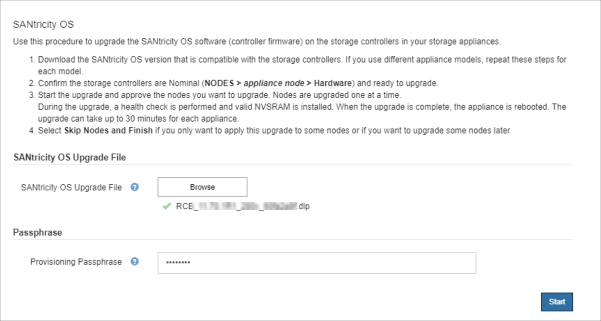
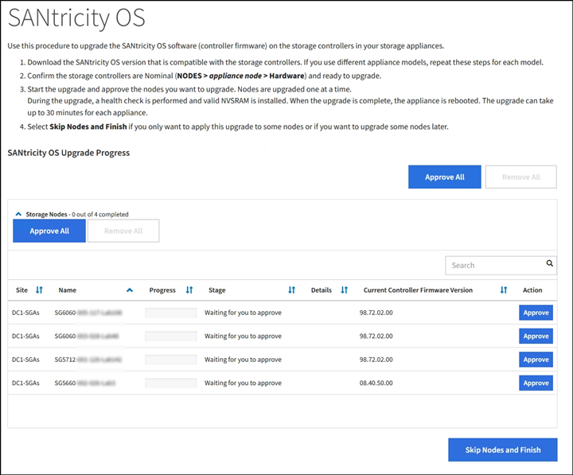

= Upgrading SANtricity OS on the storage controllers using the Grid Manager
:icons: font
:imagesdir: ../media/

[.lead]
For storage controllers currently using SANtricity OS 08.42.20.00 (11.42) or newer, you must use the Grid Manager to apply an upgrade.

.What you'll need

* You have consulted the NetApp Interoperability Matrix Tool (IMT) to confirm that the SANtricity OS version you are using for the upgrade is compatible with your appliance.
* You must have the Maintenance permission.
* You must be signed in to the Grid Manager using a supported browser.
* You must have the provisioning passphrase.
* You must have access to the NetApp downloads page for SANtricity OS.

.About this task

You cannot perform other software updates (StorageGRID software upgrade or a hotfix) until you have completed the SANtricity OS upgrade process. If you attempt to start a hotfix or a StorageGRID software upgrade before the SANtricity OS upgrade process has finished, you are redirected to the SANtricity OS upgrade page.

The procedure will not be complete until the SANtricity OS upgrade has been successfully applied to all applicable nodes. It might take more than 30 minutes to load the SANtricity OS on each node and up to 90 minutes to reboot each StorageGRID storage appliance.

CAUTION: The following steps are only applicable when you are using the Grid Manager to perform the upgrade. The storage controllers in the SG6000 series appliances cannot be upgraded using the Grid Manager when the controllers are using SANtricity OS older than 08.42.20.00 (11.42).

NOTE: This procedure will automatically upgrade the NVSRAM to the most recent version associated with the SANtricity OS upgrade. You do not need to apply a separate NVSRAM upgrade file.

.Steps

. From a service laptop, download the new SANtricity OS Software file from the NetApp support site.
+
Be sure to choose the correct SANtricity OS version for the storage controllers in your appliance. The SG6060 uses the E2800 controller, and the SGF6024 uses the EF570 controller.
+
https://mysupport.netapp.com/site/products/all/details/eseries-santricityos/downloads-tab[NetApp Downloads: SANtricity OS^]

. Sign in to the Grid Manager using a supported browser.
. Select *Maintenance*. Then, in the System section of the menu, select *Software Update*.
+
The Software Update page appears.
+
image::../media/software_update_landing.png[Software Update Landing Page]

. Click *SANtricity OS*.
+
The SANtricity OS page appears.
+
image::../media/santricity_os_upgrade_first.png[screenshot showing StorageGRID first SANtricity OS page]

. Select the SANtricity OS upgrade file you downloaded from the NetApp support site.
 .. Click *Browse*.
 .. Locate and select the file.
 .. Click *Open*.
+
The file is uploaded and validated. When the validation process is done, the file name is shown in the Details field.
+
NOTE: Do not change the file name since it is part of the verification process.
+

. Enter the provisioning passphrase.
+
The *Start* button is enabled.
+
image::../media/santricity_start_button.png[screenshot showing StorageGRID first SANtricity OS page]

. Click *Start*.
+
A warning box appears stating that your browser's connection might be lost temporarily as services on nodes that are upgraded are restarted.
+
image::../media/santricity_upgrade_warning.png[screenshot showing connection will be temporarily lost dialog box]

. Click *OK* to stage the SANtricity OS upgrade file to the primary Admin Node.
+
When the SANtricity OS upgrade starts:

 .. The health check is run. This process checks that no nodes have the status of Needs Attention.
+
NOTE: If any errors are reported, resolve them and click *Start* again.

 .. The SANtricity OS Upgrade Progress table appears. This table shows all Storage Nodes in your grid and the current stage of the upgrade for each node.
+
NOTE: The table shows all Storage Nodes, including software-based Storage Nodes. You must approve the upgrade for all Storage Nodes, even though a SANtricity OS upgrade has no effect on software-based Storage Nodes. The upgrade message returned for software-based Storage Nodes is "`SANtricity OS upgrade is not applicable to this node.`"
+

. Optionally, sort the list of nodes in ascending or descending order by *Site*, *Name*, *Progress*, *Stage*, or *Details*. Or, enter a term in the *Search* box to search for specific nodes.
+
You can scroll through the list of nodes by using the left and right arrows at the bottom right corner of the section.

. Approve the grid nodes you are ready to add to the upgrade queue. Approved nodes of the same type are upgraded one at a time.
+
IMPORTANT: Do not approve the SANtricity OS upgrade for an appliance storage node unless you are sure the node is ready to be stopped and rebooted.When the SANtricity OS upgrade is approved on a node, the services on that node are stopped. Later, when the node is upgraded, the appliance node is rebooted. These operations might cause service interruptions for clients that are communicating with the node.

+
** Click either of the *Approve All* buttons to add all Storage Nodes to the SANtricity OS upgrade queue.
+
NOTE: If the order in which nodes are upgraded is important, approve nodes or groups of nodes one at a time and wait until the upgrade is complete on each node before approving the next node(s).

+
** Click one or more *Approve* buttons to add one or more nodes to the SANtricity OS upgrade queue.
+
NOTE: You can delay applying a SANtricity OS upgrade to a node, but the SANtricity OS upgrade process will not be complete until you approve the SANtricity OS upgrade on all the listed Storage Nodes.

+
After you click *Approve*, the upgrade process determines if the node can be upgraded. If a node can be upgraded, it is added to the upgrade queue. +

+
For some nodes, the selected upgrade file is intentionally not applied and you can complete the upgrade process without upgrading these specific nodes. For nodes intentionally not upgraded, the process will show stage of Complete with one of the following messages in the Details column:

*** Storage Node was already upgraded.
*** SANtricity OS upgrade is not applicable to this node.
*** SANtricity OS file is not compatible with this node.

+
The message "`SANtricity OS upgrade is not applicable to this node`" indicates that the node does not have a storage controller that can be managed by the StorageGRID system. This message will appear for non-appliance Storage Nodes. You can complete the SANtricity OS upgrade process without upgrading the node displaying this message. +
The message "`SANtricity OS file is not compatible with this node`" indicates that the node requires a SANtricity OS file different than the one the process is attempting to install. After you complete the current SANtricity OS upgrade, download the SANtricity OS appropriate for the node and repeat the upgrade process.

. If you need to remove a node or all nodes from the SANtricity OS upgrade queue, click *Remove* or *Remove All*.
+
As shown in the example, when the stage progresses beyond Queued, the *Remove* button is hidden and you can no longer remove the node from the SANtricity OS upgrade process.
+
image::../media/approve_all_progresstable.png[SANtricity Upgrade Remove Button]

. Wait while the SANtricity OS upgrade is applied to each approved grid node.
+
IMPORTANT: If any node shows a stage of Error while the SANtricity OS upgrade is being applied, the upgrade has failed for that node. The appliance might need to be placed in maintenance mode to recover from the failure. Contact technical support before continuing.
+
If the firmware on the node is too old to be upgraded with the Grid Manager, the node shows a stage of Error with the details: "`You must use maintenance mode to upgrade SANtricity OS on this node. See the installation and maintenance instructions for your appliance. After the upgrade, you can use this utility for future upgrades.`" To resolve the error, do the following:

 .. Use maintenance mode to upgrade SANtricity OS on the node that shows a stage of Error.
 .. Use the Grid Manager to re-start and complete the SANtricity OS upgrade.
+
When the SANtricity OS upgrade is complete on all approved nodes, the SANtricity OS Upgrade Progress table closes and a green banner shows the date and time the SANtricity OS upgrade was completed.
+
image::../media/santricity_upgrade_finish_banner.png[screenshot of SANtricity OS upgrade page after the upgrade completes]

. Repeat this upgrade procedure for any nodes with a stage of Complete that require a different SANtricity OS upgrade file.
+
NOTE: For any nodes with a status of Needs Attention, use maintenance mode to perform the upgrade.

.Related information

https://mysupport.netapp.com/matrix[NetApp Interoperability Matrix Tool^]

xref:upgrading_santricity_os_on_storage_controllers_using_maintenance_mode_sg6000.adoc[Upgrading SANtricity OS on the storage controllers using maintenance mode]
