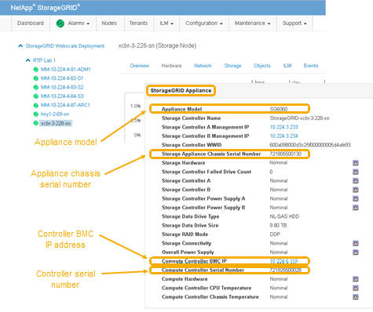

= Verifying the Fibre Channel HBA to replace
:icons: font
:imagesdir: ../media/

[.lead]
If you are unsure which Fibre Channel host bus adapter (HBA) to replace, complete this procedure to identify it.

.What you'll need

* You have the serial number of the storage appliance or SG6000-CN controller where the Fibre Channel HBA needs to be replaced.
+
NOTE: If the serial number of the storage appliance containing the Fibre Channel HBA you are replacing starts with the letter Q, it will not be listed in the Grid Manager. You must check the tags attached to the front of each SG6000-CN controller in the data center until you find a match.

* You must be signed in to the Grid Manager using a xref:../admin/web_browser_requirements.adoc[supported web browser].

.Steps

. From the Grid Manager, select *Nodes*.
. From the tree view of the Nodes page, select an appliance Storage Node.
. Select the *Hardware* tab.
+
Check the Storage Appliance Chassis Serial Number and the Compute Controller Serial Number in the StorageGRID Appliance section to see if one of these serial numbers matches the serial number of the storage appliance where you are replacing the Fibre Channel HBA. If either serial number matches, you have found the correct appliance.
+

 ** If the StorageGRID Appliance section does not display, the node selected is not a StorageGRID appliance. Select a different node from the tree view.
 ** If the Appliance Model is not SG6060, select a different node from the tree view.
 ** If the serial numbers do not match, select a different node from the tree view.

. After you locate the node where the Fibre Channel HBA needs to be replaced, write down the Compute Controller BMC IP address listed the StorageGRID Appliance section.
+
You can use this IP address to turn on the compute controller identify LED, to help you locate the appliance in the data center.
+
xref:turning_controller_identify_led_on_and_off.adoc[Turning the controller identify LED on and off]

.Related information

xref:removing_fibre_channel_hba.adoc[Removing the Fibre Channel HBA]
