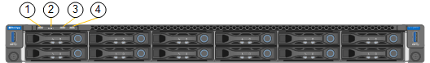

= Viewing status indicators and buttons on the SG6000-CN controller
:icons: font
:imagesdir: ../media/

[.lead]
The SG6000-CN controller includes indicators that help you determine the status of the controller, including the following indicators and buttons.

[options="header"]
|===
|  | Display| Description
a|
1
a|
Power button
a|
* Blue: The controller is powered on.
* Off: The controller is powered off.
a|
2
a|
Reset button
a|
_No indicator_

Use this button to perform a hard reset of the controller.
a|
3
a|
Identify button
a|
* Blinking or solid blue: Identifies the controller in the cabinet or rack.
* Off: The controller is not visually identifiable in the cabinet or rack.

This button can be set to Blink, On (Solid), or Off.
a|
4
a|
Alarm LED
a|
* Amber: An error has occurred.
+
*Note:* To view the boot-up and error codes, you must access the BMC interface.
* Off: No errors are present.
|===

== General boot-up codes

During boot-up or after a hard reset of the SG6000-CN controller, the following occurs:

. The baseboard management controller (BMC) logs codes for the boot-up sequence, including any errors that occur.
. The power button lights up.
. If any errors occur during boot-up, the alarm LED lights up.
+
To view the boot-up and error codes, you must access the BMC interface.

.Related information

xref:troubleshooting-hardware-installation.adoc[Troubleshooting the hardware installation]

xref:configuring-bmc-interface-sg6000.adoc[Configuring the BMC interface]

xref:powering-on-sg6000-cn-controller-and-verifying-operation.adoc[Powering on the SG6000-CN controller and verifying operation]
