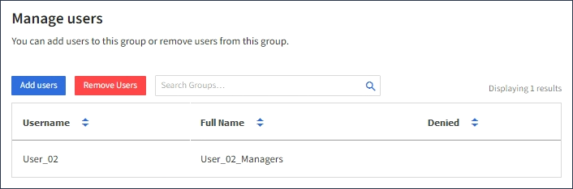
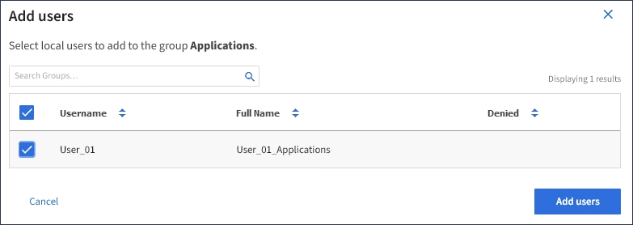

= Adding users to a local group
:icons: font
:imagesdir: ../media/

[.lead]
You can add users to a local group as needed.

.What you'll need
* You must be signed in to the Tenant Manager using a supported browser.
* You must belong to a user group that has the Root Access permission.

.Steps
. Select *ACCESS MANAGEMENT* > *Groups*.
. Select the name of the local group you want to add users to.
+
Alternatively, you can select *Actions* > *View group details*.
+
The group details page appears.
+
image::../media/tenant_group_details.png[View Group Details]

. Select *Manage Users*, and then select *Add users*.
+

. Select the users you want to add to the group, and then select *Add users*.
+

+
A confirmation message appears in the upper right corner of the page. Changes might take up to 15 minutes to take effect because of caching.
