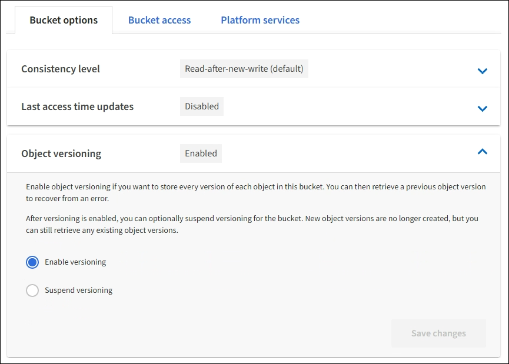

= Change object versioning for a bucket
:icons: font
:imagesdir: ../media/

[.lead]
If you are using an S3 tenant, you can use the Tenant Manager or the Tenant Management API to change the versioning state for S3 buckets.

.What you'll need
* You are signed in to the Tenant Manager using a xref:../admin/web-browser-requirements.adoc[supported web browser].
* You belong to a user group that has the Manage All Buckets or the Root Access permission. These permissions override the permissions settings in group or bucket policies.
+
xref:tenant-management-permissions.adoc[Tenant management permissions]

.About this task

You can enable or suspend object versioning for a bucket. After you enable versioning for a bucket, it cannot return to an unversioned state. However, you can suspend versioning for the bucket.

* Disabled: Versioning has never been enabled
* Enabled: Versioning is enabled
* Suspended: Versioning was previously enabled and is suspended

xref:../s3/object-versioning.adoc[S3 object versioning]

xref:../ilm/example-4-ilm-rules-and-policy-for-s3-versioned-objects.adoc[ILM rules and policies for S3 versioned objects (Example 4)]

.Steps
. Select *STORAGE (S3)* > *Buckets*.
. Select the bucket name from the list.
. Select *Bucket options* > *Object versioning*.
+

. Select a versioning state for the objects in this bucket.
+
NOTE: If S3 Object Lock or legacy compliance is enabled, the *Object versioning* options are  disabled.
+
[cols="1a,3a" options="header"]
|===
|Option |Description
|Enable versioning
|Enable object versioning if you want to store every version of each object in this bucket. You can then retrieve previous versions of an object as needed.

Objects that were already in the bucket will be versioned when they are modified by a user.

|Suspend versioning
|Suspend object versioning if you no longer want new object versions to be created. You can still retrieve any existing object versions.

|===

. Select *Save changes*.
