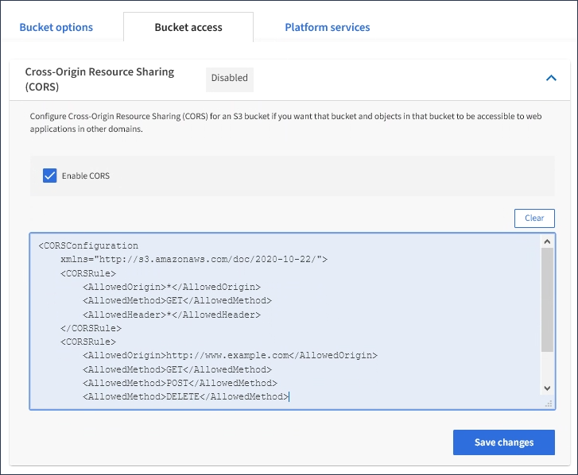

= Configure Cross-Origin Resource Sharing (CORS)
:icons: font
:imagesdir: ../media/

[.lead]
You can configure Cross-Origin Resource Sharing (CORS) for an S3 bucket if you want that bucket and objects in that bucket to be accessible to web applications in other domains.

.What you'll need

* You must be signed in to the Tenant Manager using a xref:../admin/web-browser-requirements.adoc[supported web browser].
* You must belong to a user group that has the Manage All Buckets or the Root Access permission. These permissions override the permissions settings in group or bucket policies.

.About this task

Cross-Origin Resource Sharing (CORS) is a security mechanism that allows client web applications in one domain to access resources in a different domain. For example, suppose you use an S3 bucket named `Images` to store graphics. By configuring CORS for the `Images` bucket, you can allow the images in that bucket to be displayed on the website `http://www.example.com`.

.Steps

. Use a text editor to create the XML required to enable CORS.
+
This example shows the XML used to enable CORS for an S3 bucket. This XML allows any domain to send GET requests to the bucket, but it only allows the `+http://www.example.com+` domain to send POST and DELETE requests. All request headers are allowed.
+
----
<CORSConfiguration
    xmlns="http://s3.amazonaws.com/doc/2020-10-22/">
    <CORSRule>
        <AllowedOrigin>*</AllowedOrigin>
        <AllowedMethod>GET</AllowedMethod>
        <AllowedHeader>*</AllowedHeader>
    </CORSRule>
    <CORSRule>
        <AllowedOrigin>http://www.example.com</AllowedOrigin>
        <AllowedMethod>GET</AllowedMethod>
        <AllowedMethod>POST</AllowedMethod>
        <AllowedMethod>DELETE</AllowedMethod>
        <AllowedHeader>*</AllowedHeader>
    </CORSRule>
</CORSConfiguration>
----
+
For more information about the CORS configuration XML, see http://docs.aws.amazon.com/AmazonS3/latest/dev/Welcome.html[Amazon Web Services (AWS) Documentation: Amazon Simple Storage Service Developer Guide^].

. In the Tenant Manager, select *STORAGE (S3)* > *Buckets*.
. Select the bucket name from the list.
+
The bucket details page appears.

. Select *Bucket access* > *Cross-Origin Resource Sharing (CORS)*.
. Select the *Enable CORS* check box.
. Paste the CORS configuration XML into the text box, and select *Save changes*.
+

. To modify the CORS setting for the bucket, update the CORS configuration XML in the text box or select *Clear* to start over. Then select *Save changes*.
. To disable CORS for the bucket, unselect the *Enable CORS* check box, and then select *Save changes*.
