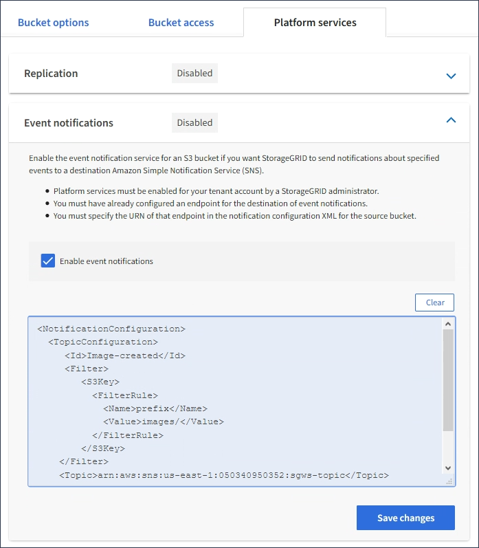

= Configure event notifications
:icons: font
:imagesdir: ../media/

[.lead]
The notifications service is one of the three StorageGRID platform services. You can enable notifications for a bucket to send information about specified events to a destination service that supports the AWS Simple Notification Service™ (SNS).

.What you'll need

* Platform services must be enabled for your tenant account by a StorageGRID administrator.
* You must have already created a bucket to act as the source of notifications.
* The endpoint that you intend to use as a destination for event notifications must already exist, and you must have its URN.
* You must belong to a user group that has the Manage All Buckets or the Root Access permission, which allows you to manage the settings for all S3 buckets in your tenant account. These permissions override the permission settings in group or bucket policies when configuring the bucket using the Tenant Manager.

.About this task

After you configure event notifications, whenever a specified event occurs for an object in the source bucket, a notification is generated and sent to the Simple Notification Service (SNS) topic used as the destination endpoint. To enable notifications for a bucket, you must create and apply valid notification configuration XML. The notification configuration XML must use the URN of an event notifications endpoint for each destination.

For general information on event notifications and how to configure them, see Amazon documentation. For information on how StorageGRID implements the S3 bucket notification configuration API, see the instructions for implementing S3 client applications.

If you enable event notifications for a bucket that contains objects, notifications are sent only for actions that are performed after the notification configuration is saved.

.Steps

. Enable notifications for your source bucket:
 * Use a text editor to create the notification configuration XML required to enable event notifications, as specified in the S3 notification API.
 * When configuring the XML, use the URN of an event notifications endpoint as the destination topic.

+
----
<NotificationConfiguration>
  <TopicConfiguration>
     <Id>Image-created</Id>
     <Filter>
        <S3Key>
          <FilterRule>
            <Name>prefix</Name>
            <Value>images/</Value>
          </FilterRule>
        </S3Key>
    </Filter>
    <Topic>arn:aws:sns:us-east-1:050340950352:sgws-topic</Topic>
    <Event>s3:ObjectCreated:*</Event>
   </TopicConfiguration>
 </NotificationConfiguration>
----
. In the Tenant Manager select *STORAGE (S3)* > *Buckets*.
. Select the name of the source bucket.
+
The bucket details page appears.

. Select *Platform services* > *Event notifications*.
. Select the *Enable event notifications* check box.
. Paste the notification configuration XML into the text box, and select *Save changes*.
+

+
NOTE: Platform services must be enabled for each tenant account by a StorageGRID administrator using the Grid Manager or Grid Management API. Contact your StorageGRID administrator if an error occurs when you save the configuration XML.

. Verify that event notifications are configured correctly:
 .. Perform an action on an object in the source bucket that meets the requirements for triggering a notification as configured in the configuration XML.
+
In the example, an event notification is sent whenever an object is created with the `images/` prefix.

 .. Confirm that a notification has been delivered to the destination SNS topic.
+
For example, if your destination topic is hosted on the AWS Simple Notification Service (SNS), you could configure the service to send you an email when the notification is delivered.
+
----
{
   "Records":[
      {
         "eventVersion":"2.0",
         "eventSource":"sgws:s3",
         "eventTime":"2017-08-08T23:52:38Z",
         "eventName":"ObjectCreated:Put",
         "userIdentity":{
            "principalId":"1111111111111111111"
         },
         "requestParameters":{
            "sourceIPAddress":"193.51.100.20"
         },
         "responseElements":{
            "x-amz-request-id":"122047343"
         },
         "s3":{
            "s3SchemaVersion":"1.0",
            "configurationId":"Image-created",
            "bucket":{
               "name":"test1",
               "ownerIdentity":{
                  "principalId":"1111111111111111111"
               },
               "arn":"arn:sgws:s3:::test1"
            },
            "object":{
               "key":"images/cat.jpg",
               "size":0,
               "eTag":"d41d8cd98f00b204e9800998ecf8427e",
               "sequencer":"14D90402421461C7"
            }
         }
      }
   ]
}
----

+
If the notification is received at the destination topic, you have successfully configured your source bucket for StorageGRID notifications.

.Related information

xref:understanding-notifications-for-buckets.adoc[Understand notifications for buckets]

xref:../s3/index.adoc[Use S3]

xref:creating-platform-services-endpoint.adoc[Create platform services endpoint]
