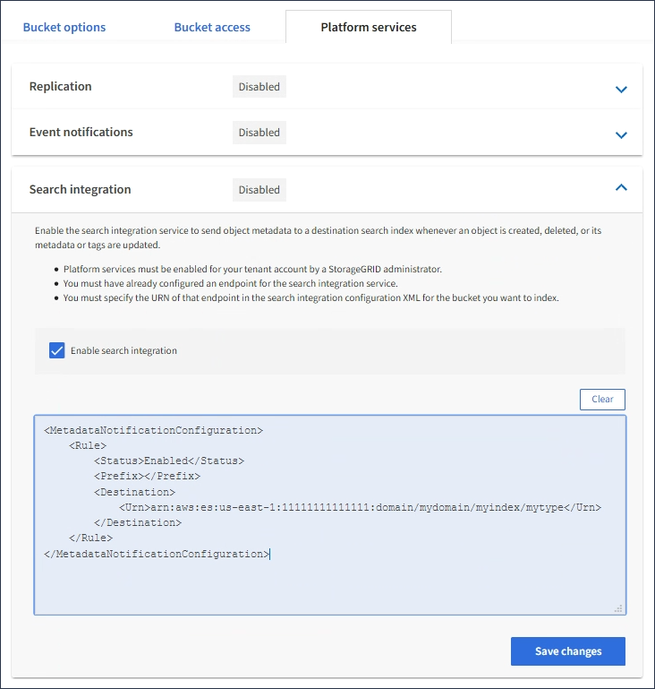

= Configure the search integration service
:icons: font
:imagesdir: ../media/

[.lead]
The search integration service sends object metadata to a destination search index whenever an object is created, deleted, or its metadata or tags are updated.

.What you'll need

* Platform services must be enabled for your tenant account by a StorageGRID administrator.
* You must have already created an S3 bucket whose contents you want to index.
* The endpoint that you intend to use as a destination for the search integration service must already exist, and you must have its URN.
* You must belong to a user group that has the Manage All Buckets or the Root Access permission, which allows you to manage the settings for all S3 buckets in your tenant account. These permissions override the permission settings in group or bucket policies when configuring the bucket using the Tenant Manager.

.About this task

After you configure the search integration service for a source bucket, creating an object or updating an object's metadata or tags triggers object metadata to be sent to the destination endpoint. If you enable the search integration service for a bucket that already contains objects, metadata notifications are not automatically sent for existing objects. You must update these existing objects to ensure that their metadata is added to the destination search index.

.Steps

. Use a text editor to create the metadata notification XML required to enable search integration.
 * See the information about configuration XML for search integration.
 * When configuring the XML, use the URN of a search integration endpoint as the destination.

+
----
<MetadataNotificationConfiguration>
 <Rule>
    <Status>Enabled</Status>
    <Prefix></Prefix>
    <Destination>
       <Urn>arn:aws:es:us-east-1:11111111111111:domain/mydomain/myindex/mytype</Urn>
       </Destination>
 </Rule>
</MetadataNotificationConfiguration>
----
. In the Tenant Manager select *STORAGE (S3)* > *Buckets*.
. Select the name of the source bucket.
+
The bucket details page appears.

. Select *Platform services* > *Search integration*
. Select the *Enable search integration* check box.
. Paste the metadata notification configuration into the text box, and select *Save changes*.
+

+
NOTE: Platform services must be enabled for each tenant account by a StorageGRID administrator using the Grid Manager or Management API. Contact your StorageGRID administrator if an error occurs when you save the configuration XML.

. Verify that the search integration service is configured correctly:
 .. Add an object to the source bucket that meets the requirements for triggering a metadata notification as specified in the configuration XML.
+
In the example shown earlier, all objects added to the bucket trigger a metadata notification.

 .. Confirm that a JSON document that contains the object's metadata and tags was added to the search index specified in the endpoint.

.After you finish

As necessary, you can disable search integration for a bucket using either of the following methods:

* Select *STORAGE (S3)* > *Buckets* and unselect the *Enable search integration* check box.
* If you are using the S3 API directly, use a DELETE Bucket metadata notification request. See the instructions for implementing S3 client applications.

.Related information

xref:understanding-search-integration-service.adoc[Understand search integration service]

xref:configuration-xml-for-search-configuration.adoc[Configuration XML for search integration]

xref:../s3/index.adoc[Use S3]

xref:creating-platform-services-endpoint.adoc[Create platform services endpoint]
