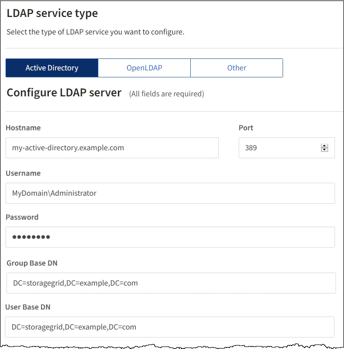

= Configuring a federated identity source
:icons: font
:imagesdir: ../media/

[.lead]
You can configure identity federation if you want tenant groups and users to be managed in another system such as Active Directory, OpenLDAP, or Oracle Directory Server.

.What you'll need

* You must be signed in to the Tenant Manager using a supported browser.
* You must have specific access permissions.
* You must be using Active Directory, OpenLDAP, or Oracle Directory Server as the identity provider. If you want to use an LDAP v3 service that is not listed, you must contact technical support.
* If you plan to use Transport Layer Security (TLS) for communications with the LDAP server, the identity provider must be using TLS 1.2 or 1.3.

Whether you can configure an identity federation service for your tenant depends on how your tenant account was set up. Your tenant might share the identity federation service that was configured for the Grid Manager. If you see this message when you access the Identity Federation page, you cannot configure a separate federated identity source for this tenant.

image::../media/tenant_shares_identity_federation.png[Tenant Shares Identity Federation]

.Steps

. Select *ACCESS MANAGEMENT* > *Identity federation*.
. Select *Enable identity federation*.
. In the LDAP service type section, select *Active Directory*, *OpenLDAP*, or *Other*.
+
If you select *OpenLDAP*, configure the OpenLDAP server. See the guidelines for configuring an OpenLDAP server.
+
Select *Other* to configure values for an LDAP server that uses Oracle Directory Server.

. If you selected *Other*, complete the fields in the LDAP Attributes section.
 ** *User Unique Name*: The name of the attribute that contains the unique identifier of an LDAP user. This attribute is equivalent to sAMAccountName for Active Directory and uid for OpenLDAP. If you are configuring Oracle Directory Server, enter uid.
 ** *User UUID*: The name of the attribute that contains the permanent unique identifier of an LDAP user. This attribute is equivalent to objectGUID for Active Directory and entryUUID for OpenLDAP. If you are configuring Oracle Directory Server, enter nsuniqueid. Each user's value for the specified attribute must be a 32-digit hexadecimal number in either 16-byte or string format, where hyphens are ignored.
 ** *Group unique name*: The name of the attribute that contains the unique identifier of an LDAP group. This attribute is equivalent to sAMAccountName for Active Directory and cn for OpenLDAP. If you are configuring Oracle Directory Server, enter cn.
 ** *Group UUID*: The name of the attribute that contains the permanent unique identifier of an LDAP group. This attribute is equivalent to objectGUID for Active Directory and entryUUID for OpenLDAP. If you are configuring Oracle Directory Server, enter nsuniqueid. Each group's value for the specified attribute must be a 32-digit hexadecimal number in either 16-byte or string format, where hyphens are ignored.
. In the Configure LDAP server section, enter the required LDAP server and network connection information.
 ** *Hostname*: The server hostname or IP address of the LDAP server.
 ** *Port*: The port used to connect to the LDAP server. The default port for STARTTLS is 389, and the default port for LDAPS is 636. However, you can use any port as long as your firewall is configured correctly.
 ** *Username*: The full path of the distinguished name (DN) for the user that will connect to the LDAP server. For Active Directory, you can also specify the Down-Level Logon Name or the User Principal Name.
+
The specified user must have permission to list groups and users and to access the following attributes:

  *** sAMAccountName or uid
  *** objectGUID, entryUUID, or nsuniqueid
  *** cn
  *** memberOf or isMemberOf

 ** *Password*: The password associated with the username.
 ** *Group base DN*: The full path of the distinguished name (DN) for an LDAP subtree you want to search for groups. In the Active Directory example (below), all groups whose Distinguished Name is relative to the base DN (DC=storagegrid,DC=example,DC=com) can be used as federated groups.
+
The *Group unique name* values must be unique within the *Group base DN* they belong to.

 ** *User base DN*: The full path of the distinguished name (DN) of an LDAP subtree you want to search for users.
+
The *User unique name* values must be unique within the *User base DN* they belong to.
. In the *Transport Layer Security (TLS)* section, select a security setting.
 ** *Use STARTTLS (recommended)*: Use STARTTLS to secure communications with the LDAP server. This is the recommended option.
 ** *Use LDAPS*: The LDAPS (LDAP over SSL) option uses TLS to establish a connection to the LDAP server. This option is supported for compatibility reasons.
 ** *Do not use TLS*: The network traffic between the StorageGRID system and the LDAP server will not be secured.
+
This option is not supported if your Active Directory server enforces LDAP signing. You must use STARTTLS or LDAPS.
. If you selected STARTTLS or LDAPS, choose the certificate used to secure the connection.
 ** *Use operating system CA certificate*: Use the default CA certificate installed on the operating system to secure connections.
 ** *Use custom CA certificate*: Use a custom security certificate.
+
If you select this setting, copy and paste the custom security certificate into the CA certificate text box.
. Select *Test connection* to validate your connection settings for the LDAP server.
+
A confirmation message appears in the upper right corner of the page if the connection is valid.

. If the connection is valid, select *Save*.
+
The following screenshot shows example configuration values for an LDAP server that uses Active Directory.
+

.Related information

xref:tenant_management_permissions.adoc[Tenant management permissions]

xref:guidelines_for_configuring_openldap_server.adoc[Guidelines for configuring an OpenLDAP server]
