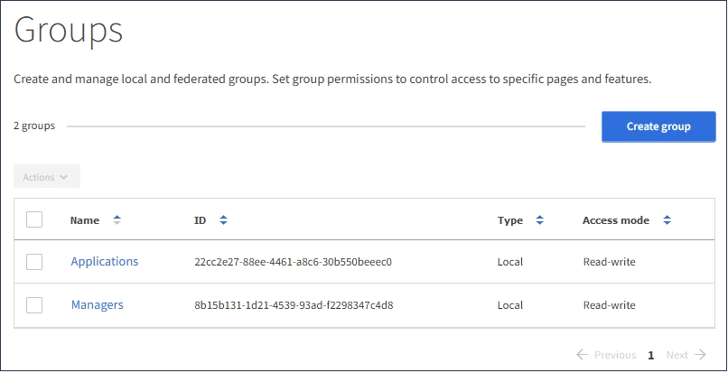

= Create groups for a Swift tenant
:icons: font
:imagesdir: ../media/

[.lead]
You can manage access permissions for a Swift tenant account by importing federated groups or creating local groups. At least one group must have the Swift Administrator permission, which is required to manage the containers and objects for a Swift tenant account.

.What you'll need

* You must be signed in to the Tenant Manager using a xref:../admin/web-browser-requirements.adoc[supported web browser].
* You must belong to a user group that has the Root Access permission.
* If you plan to import a federated group, you have configured identity federation and the federated group already exists in the configured identity source.

.Steps
. Select *ACCESS MANAGEMENT* > *Groups*.
+

. Select *Create group*.
. Select the *Local group* tab to create a local group, or select the *Federated group* tab to import a group from the previously configured identity source.
+
If single sign-on (SSO) is enabled for your StorageGRID system, users belonging to local groups will not be able to sign in to the Tenant Manager, although they can use client applications to manage the tenant's resources, based on group permissions.

. Enter the group's name.
 ** *Local group*: Enter both a display name and a unique name. You can edit the display name later.
 ** *Federated group*: Enter the unique name. For Active Directory, the unique name is the name associated with the `sAMAccountName` attribute. For OpenLDAP, the unique name is the name associated with the `uid` attribute.
. Select *Continue*.
. Select an Access mode. If a user belongs to multiple groups and any group is set to Read-only, the user will have read-only access to all selected settings and features.
 ** *Read-write* (default): Users can log into Tenant Manager and manage the tenant configuration.
 ** *Read-only*: Users can only view settings and features. They cannot make any changes or perform any operations in the Tenant Manager or Tenant Management API. Local read-only users can change their own passwords.
. Set the Group permission.
 ** Select the *Root Access* check box if users need to sign in to the Tenant Manager or Tenant Management API. (Default)
 ** Unselect the *Root Access* check box if users do not need access to the Tenant Manager or Tenant Management API. For example, unselect the check box for applications that do not need to access the tenant. Then, assign the *Swift Administrator* permission to allow these users to manage containers and objects.
. Select *Continue*.
. Select the *Swift administrator* check box if the user needs to be able to use the Swift REST API.
+
Swift users must have the Root Access permission to access the Tenant Manager. However, the Root Access permission does not allow users to authenticate into the Swift REST API to create containers and ingest objects. Users must have the Swift Administrator permission to authenticate into the Swift REST API.

. Select the button that appears, depending on whether you are creating a federated group or a local group:
 ** Federated group: *Create group*
 ** Local group: *Continue*
+
If you are creating a local group, step 4 (Add users) appears after you select *Continue*. This step does not appear for federated groups.
. Select the check box for each user you want to add to the group, then select *Create group*.
+
Optionally, you can save the group without adding users. You can add users to the group later, or select the group when you create new users.

. Select *Finish*.
+
The group you created appears in the list of groups. Changes might take up to 15 minutes to take effect because of caching.

.Related information

xref:tenant-management-permissions.adoc[Tenant management permissions]

xref:../swift/index.adoc[Use Swift]
