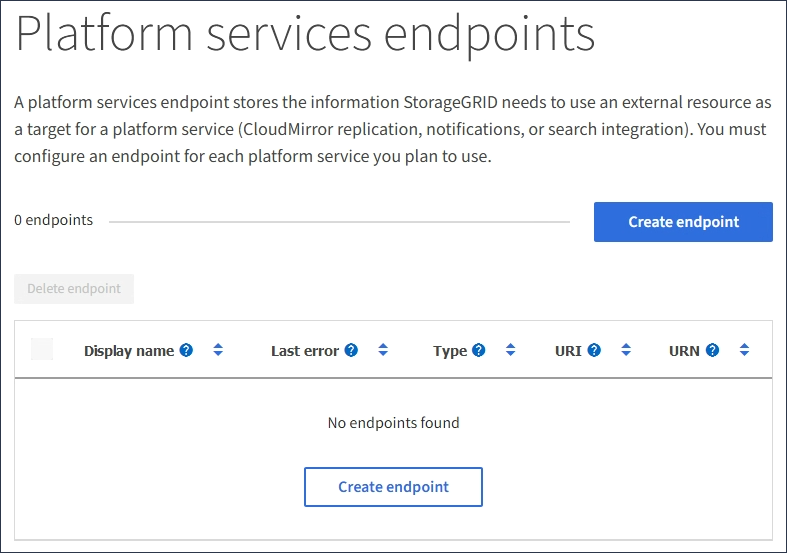
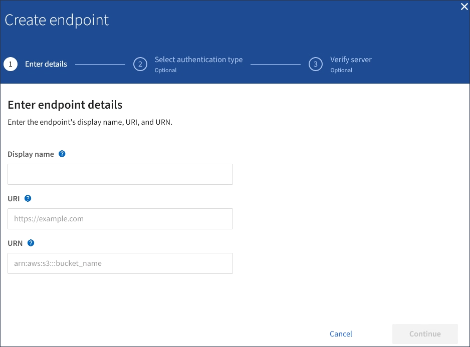
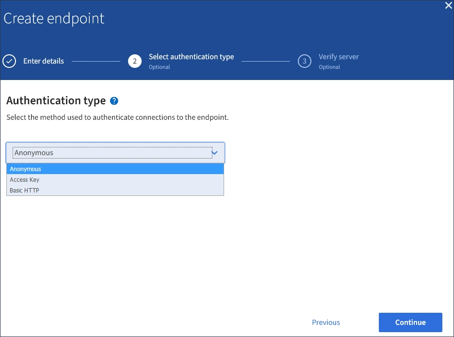
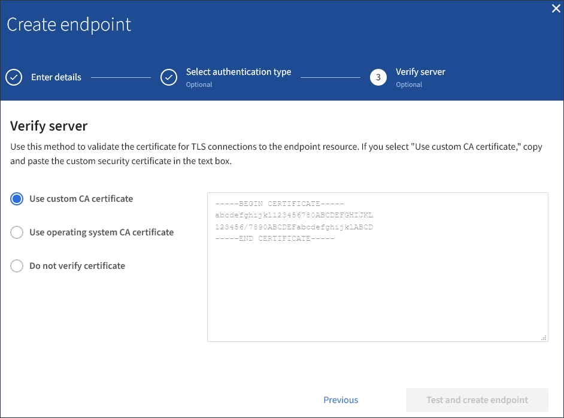

= Create platform services endpoint
:icons: font
:imagesdir: ../media/

[.lead]
You must create at least one endpoint of the correct type before you can enable a platform service.

.What you'll need

* You must be signed in to the Tenant Manager using a xref:../admin/web-browser-requirements.adoc[supported web browser].
* Platform services must be enabled for your tenant account by a StorageGRID administrator.
* You must belong to a user group that has the Manage Endpoints permission.
* The resource referenced by the platform services endpoint must have been created:
 ** CloudMirror replication: S3 bucket
 ** Event notification: SNS topic
 ** Search notification: Elasticsearch index, if the destination cluster is not configured to automatically create indexes.
* You must have the information about the destination resource:
 ** Host and port for the Uniform Resource Identifier (URI)
+
NOTE: If you plan to use a bucket hosted on a StorageGRID system as an endpoint for CloudMirror replication, contact the grid administrator to determine the values you need to enter.

 ** Unique Resource Name (URN)
+
xref:specifying-urn-for-platform-services-endpoint.adoc[Specify URN for platform services endpoint]

 ** Authentication credentials (if required):
  *** Access Key: Access key ID and secret access key
  *** Basic HTTP: Username and password
  *** CAP (C2S Access Portal): Temporary credentials URL, server and client certificates, client keys, and an optional client private key passphrase.
 ** Security certificate (if using a custom CA certificate)

.Steps

. Select *STORAGE (S3)* > *Platform services endpoints*.
+
The Platform services endpoints page appears.
+

. Select *Create endpoint*.
+

. Enter a display name to briefly describe the endpoint and its purpose.
+
The type of platform service that the endpoint supports is shown beside the endpoint name when it is listed on the Endpoints page, so you do not need to include that information in the name.

. In the *URI* field, specify the Unique Resource Identifier (URI) of the endpoint.
+
Use one of the following formats:
+
----
https://host:port
http://host:port
----
+
If you do not specify a port, port 443 is used for HTTPS URIs and port 80 is used for HTTP URIs.
+
For example, the URI for a bucket hosted on StorageGRID might be:
+
----
https://s3.example.com:10443
----
+
In this example, `s3.example.com` represents the DNS entry for the virtual IP (VIP) of the StorageGRID high availability (HA) group, and `10443` represents the port defined in the load balancer endpoint.
+
NOTE: Whenever possible, you should connect to a HA group of load-balancing nodes to avoid a single point of failure.

+
Similarly, the URI for a bucket hosted on AWS might be:
+
----
https://s3-aws-region.amazonaws.com
----

+
NOTE: If the endpoint is used for the CloudMirror replication service, do not include the bucket name in the URI. You include the bucket name in the *URN* field.

. Enter the Unique Resource Name (URN) for the endpoint.
+
NOTE: You cannot change an endpoint's URN after the endpoint has been created.

. Select *Continue*.
. Select a value for *Authentication type*, and then enter or upload the required credentials.
+

+
The credentials that you supply must have write permissions for the destination resource.
+
[cols="1a,2a,2a" options="header"]
|===
| Authentication type| Description| Credentials
|Anonymous
|Provides anonymous access to the destination. Only works for endpoints that have security disabled.
|No authentication.

|Access Key
|Uses AWS-style credentials to authenticate connections with the destination.
|
* Access key ID
* Secret access key

|Basic HTTP
|Uses a username and password to authenticate connections to the destination.
|
* Username
* Password

|CAP (C2S Access Portal)
|Uses certificates and keys to authenticate connections to the destination.
|
* Temporary credentials URL
* Server CA certificate (PEM file upload)
* Client certificate (PEM file upload)
* Client private key (PEM file upload, OpenSSL encrypted format or unencrypted private key format)
* Client private key passphrase (optional)
|===

. Select *Continue*.
. Select a radio button for *Verify server* to choose how TLS connection to the endpoint is verified.
+

+
[cols="1a,2a" options="header"]
|===
| Type of certificate verification| Description
a|Use custom CA certificate
a|Use a custom security certificate. If you select this setting, copy and paste the custom security certificate in the *CA Certificate* text box.

a|Use operating system CA certificate
a|Use the default Grid CA certificate installed on the operating system to secure connections.

a|Do not verify certificate
a|The certificate used for the TLS connection is not verified. This option is not secure.
|===

. Select *Test and create endpoint*.
* A success message appears if the endpoint can be reached using the specified credentials. The connection to the endpoint is validated from one node at each site.
* An error message appears if endpoint validation fails. If you need to modify the endpoint to correct the error, select *Return to endpoint details* and update the information. Then, select *Test and create endpoint*.
+
NOTE: Endpoint creation fails if platform services are not enabled for your tenant account. Contact your StorageGRID administrator.

After you have configured an endpoint, you can use its URN to configure a platform service.

.Related information

xref:specifying-urn-for-platform-services-endpoint.adoc[Specify URN for platform services endpoint]

xref:configuring-cloudmirror-replication.adoc[Configure CloudMirror replication]

xref:configuring-event-notifications.adoc[Configure event notifications]

xref:configuring-search-integration-service.adoc[Configure search integration service]
