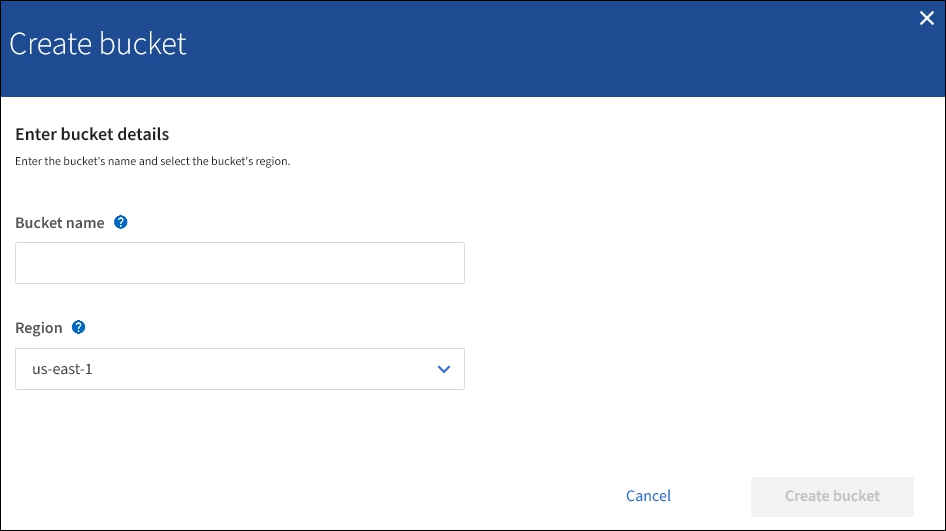

= Create S3 bucket
:icons: font
:imagesdir: ../media/

[.lead]
You can use the Tenant Manager to create S3 buckets for object data. When you create a bucket, you must specify the bucket's name and region. If the global S3 Object Lock setting is enabled for the StorageGRID system, you can optionally enable S3 Object Lock for the bucket.

.What you'll need

* You are signed in to the Tenant Manager using a xref:../admin/web-browser-requirements.adoc[supported web browser].
* You belong to a user group that has the Manage All Buckets or the Root Access permission. These permissions override the permissions settings in group or bucket policies.
+
NOTE: Permissions to set or modify S3 Object Lock properties of buckets or objects can be granted by xref:../s3/bucket-and-group-access-policies.adoc[bucket policy or group policy].

* If you plan to create a bucket with S3 Object Lock, you have enabled the global S3 Object Lock setting for the StorageGRID system, and you have reviewed the requirements for S3 Object Lock buckets and objects.
+
xref:using-s3-object-lock.adoc[Use S3 Object Lock]

.Steps
. Select *STORAGE (S3)* > *Buckets*.
+
//image::../media/buckets_page.png[Buckets Page]

. Select *Create bucket*.
+

+
. Enter a unique name for the bucket.
+
IMPORTANT: You cannot change the bucket name after creating the bucket.
+
Bucket names must comply with these rules:

 ** Must be unique across each StorageGRID system (not just unique within the tenant account).
 ** Must be DNS compliant.
 ** Must contain at least 3 and no more than 63 characters.
 ** Each label must start and end with a lowercase letter or a number and can only use lowercase letters, numbers, and hyphens.
 ** Should not use periods in virtual hosted style requests. Periods will cause problems with server wildcard certificate verification.

+
NOTE: For more information, see the https://docs.aws.amazon.com/AmazonS3/latest/userguide/bucketnamingrules.html[Amazon Web Services (AWS) documentation on bucket naming rules^].

. Select the region for this bucket.
+
Your StorageGRID administrator manages the available regions. A bucket's region can affect the data-protection policy applied to objects. By default, all buckets are created in the `us-east-1` region.
+
IMPORTANT: You cannot change the region after creating the bucket.

. Select *Continue*.

. Optionally, enable object versioning for the bucket.
+
Enable object versioning if you want to store every version of each object in this bucket. You can then retrieve previous versions of an object as needed.

. If the S3 Object Lock section appears, optionally enable S3 Object Lock for the bucket.
+
IMPORTANT: You cannot enable or disable S3 Object Lock after creating the bucket.

+
// image::../media/bucket_create_s3_object_lock_enabled.png[Bucket Create S3 Object Lock Enabled]
+
The S3 Object Lock section appears only if the global S3 Object Lock setting is enabled.
+
S3 Object Lock must be enabled for the bucket before an S3 client application can specify retain-until-date and legal hold settings for the objects added to the bucket.
+
If you enable S3 Object Lock for a bucket, bucket versioning is enabled automatically. You can also xref:../s3/operations-on-buckets.adoc#using-s3-object-lock-default-bucket-retention[specify a default retention mode and default retention period for the bucket] that are applied to each object ingested to the bucket that does not specify its own retention settings.

. Select *Create bucket*.
+
The bucket is created and added to the table on the Buckets page.

.Related information

xref:../ilm/index.adoc[Manage objects with ILM]

xref:understanding-tenant-management-api.adoc[Understand Tenant Management API]

xref:../s3/index.adoc[Use S3]
