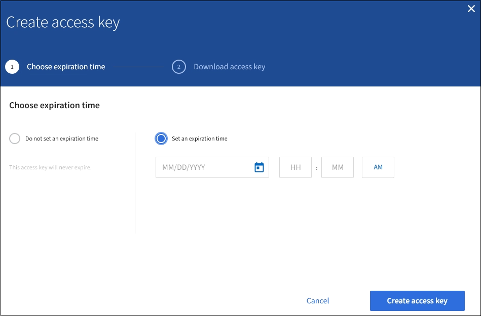
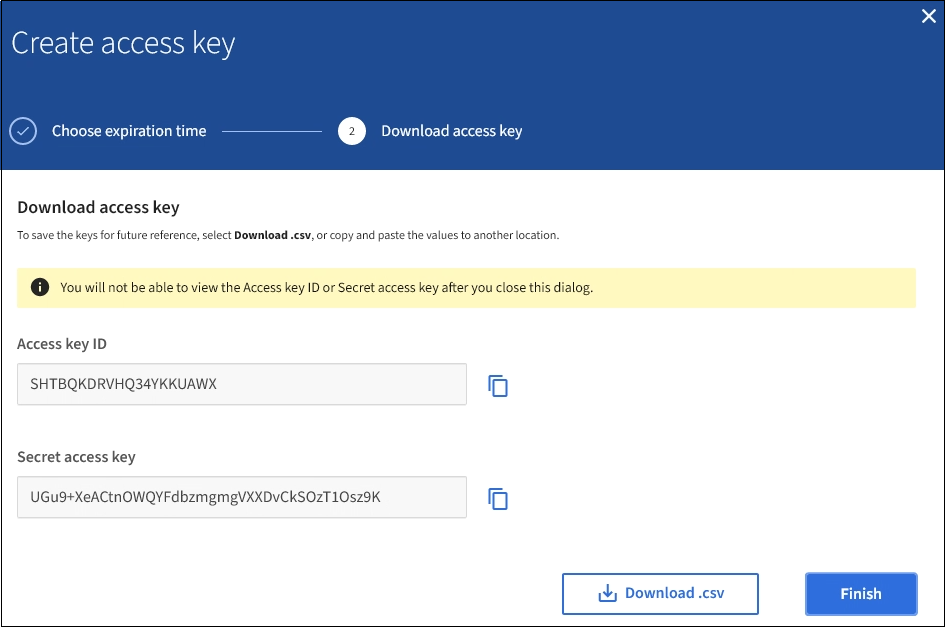

= Create your own S3 access keys
:icons: font
:imagesdir: ../media/

[.lead]
If you are using an S3 tenant and you have the appropriate permission, you can create your own S3 access keys. You must have an access key to access your buckets and objects in the S3 tenant account.

.What you'll need

* You must be signed in to the Tenant Manager using a xref:../admin/web-browser-requirements.adoc[supported web browser].
* You must have the Manage Your Own S3 Credentials permission. See xref:tenant-management-permissions.adoc[Tenant management permissions].

.About this task

You can create one or more S3 access keys that allow you to create and manage buckets for your tenant account. After you create a new access key, update the application with your new access key ID and secret access key. For security, do not create more keys than you need, and delete the keys you are not using. If you have only one key and it is about to expire, create a new key before the old one expires, and then delete the old one.

Each key can have a specific expiration time or no expiration. Follow these guidelines for expiration time:

* Set an expiration time for your keys to limit your access to a certain time period. Setting a short expiration time can help reduce your risk if your access key ID and secret access key are accidentally exposed. Expired keys are removed automatically.
* If the security risk in your environment is low and you do not need to periodically create new keys, you do not have to set an expiration time for your keys. If you decide later to create new keys, delete the old keys manually.

IMPORTANT: The S3 buckets and objects belonging to your account can be accessed using the access key ID and secret access key displayed for your account in the Tenant Manager. For this reason, protect access keys as you would a password. Rotate access keys on a regular basis, remove any unused keys from your account, and never share them with other users.

.Steps
. Select *STORAGE (S3)* > *My access keys*.
+
The My access keys page appears and lists any existing access keys.

. Select *Create key*.
. Do one of the following:
 ** Select *Do not set an expiration time* to create a key that will not expire. (Default)
 ** Select *Set an expiration time*, and set the expiration date and time.
+

. Select *Create access key*.
+
The Download access key dialog box appears, listing your access key ID and secret access key.

. Copy the access key ID and the secret access key to a safe location, or select *Download .csv* to save a spreadsheet file containing the access key ID and secret access key.
+
IMPORTANT: Do not close this dialog box until you have copied or downloaded this information. You cannot copy or download keys after the dialog box has been closed.
+

. Select *Finish*.
+
The new key is listed on the My access keys page. Changes might take up to 15 minutes to take effect because of caching.