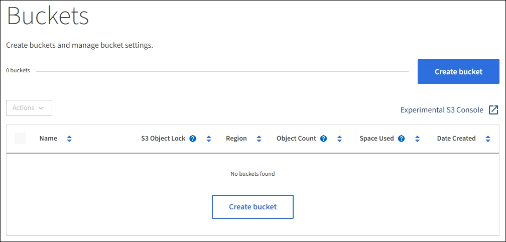

= Creating an S3 bucket
:icons: font
:imagesdir: ../media/

[.lead]
You can use the Tenant Manager to create S3 buckets for object data. When you create a bucket, you must specify the bucket's name and region. If the global S3 Object Lock setting is enabled for the StorageGRID system, you can optionally enable S3 Object Lock for the bucket.

.What you'll need

* You must be signed in to the Tenant Manager using a supported browser.
* You must belong to a user group that has the Manage All Buckets or the Root Access permission. These permissions override the permissions settings in group or bucket policies.
* If you plan to create a bucket with S3 Object Lock, the global S3 Object Lock setting must have been enabled for the StorageGRID system and you must have reviewed the requirements for S3 Object Lock buckets and objects.
+
xref:using_s3_object_lock.adoc[Using S3 Object Lock]

.Steps
. Select *STORAGE (S3)* > *Buckets*.
+
The Buckets page appears and lists any buckets that have already been created.
+

. Select *Create bucket*.
+
The Create bucket wizard appears.
+
image::../media/bucket_create_compliance_disabled.png[Bucket Create Compliance Disabled]
+
NOTE: If the global S3 Object Lock setting is enabled, Create bucket includes a second step for managing S3 Object Lock for the bucket.

. Enter a unique name for the bucket.
+
IMPORTANT: You cannot change the bucket name after creating the bucket.
+
Bucket names must comply with these rules:

 ** Must be unique across each StorageGRID system (not just unique within the tenant account).
 ** Must be DNS compliant.
 ** Must contain at least 3 and no more than 63 characters.
 ** Can be a series of one or more labels, with adjacent labels separated by a period. Each label must start and end with a lowercase letter or a number and can only use lowercase letters, numbers, and hyphens.
 ** Must not look like a text-formatted IP address.
 ** Should not use periods in virtual hosted style requests. Periods will cause problems with server wildcard certificate verification.

+
NOTE: See the Amazon Web Services (AWS) Documentation for more information.

. Select the region for this bucket.
+
Your StorageGRID administrator manages the available regions. A bucket's region can affect the data-protection policy applied to objects. By default, all buckets are created in the `us-east-1` region.
+
IMPORTANT: You cannot change the region after creating the bucket.

. Select *Create bucket* or *Continue*.
 ** If the global S3 Object Lock setting is not enabled, select *Create bucket*. The bucket is created and added to the table on the Buckets page.
 ** If the global S3 Object Lock setting is enabled, select *Continue*. Step 2, Manage S3 Object Lock, appears.
+
image::../media/bucket_create_s3_object_lock_enabled.png[Bucket Create S3 Object Lock Enabled]
. Optionally, select the check box to enable S3 Object Lock for this bucket.
+
S3 Object Lock must be enabled for the bucket before an S3 client application can specify retain-until-date and legal hold settings for the objects added to the bucket.
+
IMPORTANT: You cannot enable or disable S3 Object Lock after creating the bucket.
+
NOTE: If you enable S3 Object Lock for a bucket, bucket versioning is enabled automatically.

. Select *Create bucket*.
+
The bucket is created and added to the table on the Buckets page.

.Related information

xref:../ilm/index.adoc[Manage objects with ILM]

xref:understanding_tenant_management_api.adoc[Understanding the Tenant Management API]

xref:../s3/index.adoc[Use S3]
