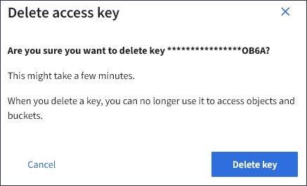

= Delete another user's S3 access keys
:icons: font
:imagesdir: ../media/

[.lead]
If you are using an S3 tenant and you have appropriate permissions, you can delete another user's S3 access keys. After an access key is deleted, it can no longer be used to access the objects and buckets in the tenant account.

.What you'll need

* You must be signed in to the Tenant Manager using a xref:../admin/web-browser-requirements.adoc[supported web browser].
* You must have the Root Access permission. See xref:tenant-management-permissions.adoc[Tenant management permissions].

IMPORTANT: The S3 buckets and objects belonging to a user can be accessed using the access key ID and secret access key displayed for that user in the Tenant Manager. For this reason, protect access keys as you would a password. Rotate access keys on a regular basis, remove any unused keys from the account, and never share them with other users.

.Steps
. Select *ACCESS MANAGEMENT* > *Users*.
+
The Users page appears and lists the existing users.

. Select the user whose S3 access keys you want to manage.
+
The User details page appears.

. Select *Access keys*, and then select the check box for each access key you want to delete.
. Select *Actions* > *Delete selected key*.
+
A confirmation dialog box appears.
+

. Select *Delete key*.
+
A confirmation message appears in the upper right corner of the page. Changes might take up to 15 minutes to take effect because of caching.