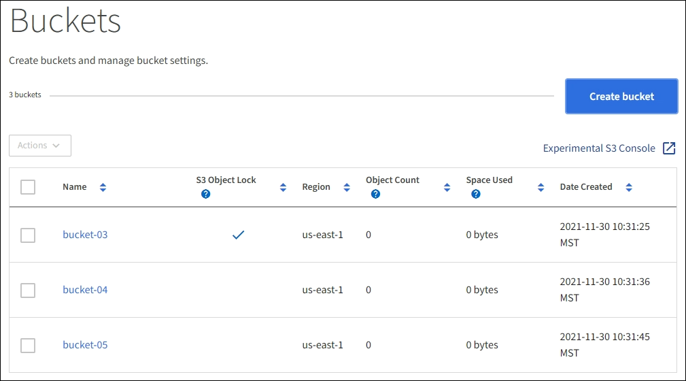
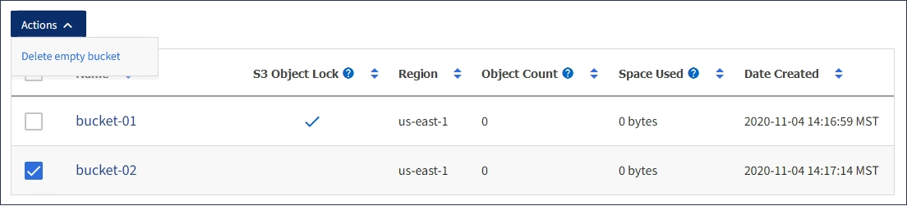

= Delete S3 bucket
:icons: font
:imagesdir: ../media/

[.lead]
You can use the Tenant Manager to delete one or more S3 buckets that are empty.

.What you'll need

* You must be signed in to the Tenant Manager using a xref:../admin/web-browser-requirements.adoc[supported web browser].
* You must belong to a user group that has the Manage All Buckets or the Root Access permission. These permissions override the permissions settings in group or bucket policies. See xref:tenant-management-permissions.adoc[Tenant management permissions].
* The buckets you want to delete are empty.

.About this task

These instructions describe how to delete an S3 bucket using the Tenant Manager. You can also delete S3 buckets using the xref:understanding-tenant-management-api.adoc[Tenant Management API] or the xref:../s3/s3-rest-api-supported-operations-and-limitations.adoc[S3 REST API].

You cannot delete an S3 bucket if it contains objects or noncurrent object versions. For information about how S3 versioned objects are deleted, see the xref:../ilm/index.adoc[instructions for managing objects with information lifecycle management].

.Steps

. Select *STORAGE (S3)* > *Buckets*.
+
The Buckets page appears and shows all existing S3 buckets.
+

. Select the check box for the empty bucket you want to delete. You can select more than one bucket at a time.
+
The Actions menu is enabled.

. From the Actions menu, select *Delete bucket* (or *Delete buckets* if you have chosen more than one).
+

+
. When the confirmation dialog box appears, select *Yes* to delete all of the buckets you have chosen.
+
StorageGRID confirms that each bucket is empty and then deletes each bucket. This operation might take a few minutes.
+
If a bucket is not empty, an error message appears. You must delete all objects before you can delete a bucket.