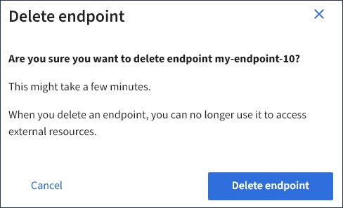

= Deleting a platform services endpoint
:icons: font
:imagesdir: ../media/

[.lead]
You can delete an endpoint if you no longer want to use the associated platform service.

* You must be signed in to the Tenant Manager using a supported browser.
* You must belong to a user group that has the *Manage Endpoints* permission.

. Select *STORAGE (S3)* > *Platform services endpoints*.
+
The Platform services endpoints page appears and shows the list of platform services endpoints that have already been configured.
+
image::../media/endpoints_list.png[Endpoints List]

. Select the check box for each endpoint you want to delete.
+
IMPORTANT: If you delete a platform services endpoint that is in use, the associated platform service will be disabled for any buckets that use the endpoint. Any requests that have not yet been completed will be dropped. Any new requests will continue to be generated until you change your bucket configuration to no longer reference the deleted URN. StorageGRID will report these requests as unrecoverable errors.

. Select *Actions* > *Delete endpoint*.
+
A confirmation message appears.
+

. Select *Delete endpoint*.
