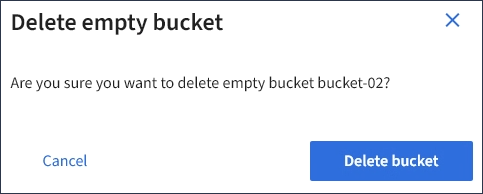
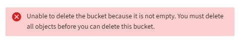

= Deleting an S3 bucket
:icons: font
:imagesdir: ../media/

[.lead]
You can use the Tenant Manager to delete an S3 bucket that is empty.

.What you'll need

* You must be signed in to the Tenant Manager using a supported browser.
* You must belong to a user group that has the Manage All Buckets or the Root Access permission. These permissions override the permissions settings in group or bucket policies.

These instructions describe how to delete an S3 bucket using the Tenant Manager. You can also delete S3 buckets using the Tenant Management API or the S3 REST API.

You cannot delete an S3 bucket if it contains objects or noncurrent object versions. For information about how S3 versioned objects are deleted, see the instructions for managing objects with information lifecycle management.

.Steps

. Select *STORAGE (S3)* > *Buckets*.
+
The Buckets page appears and shows all existing S3 buckets.
+
image::../media/buckets_table.png[Buckets Table]

. Select the check box for the empty bucket you want to delete.
+
The Actions menu is enabled.

. From the Actions menu, select *Delete empty bucket*.
+
image::../media/delete_bucket_button.png[Delete Buckets Button]
+
A confirmation message appears.
+

. If you are sure you want to delete the bucket, select *Delete bucket*.
+
StorageGRID confirms that the bucket is empty and then deletes the bucket. This operation might take a few minutes.
+
If the bucket is not empty, an error message appears. You must delete all objects before you can delete the bucket.
+

.Related information

http://docs.netapp.com/sgws-115/topic/com.netapp.doc.sg-ilm/home.html[Managing objects with information lifecycle management]
