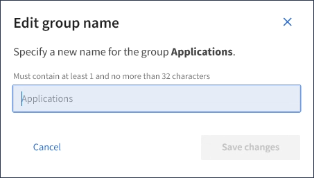

= Edit group name
:icons: font
:imagesdir: ../media/

[.lead]
You can edit the display name for a group. You cannot edit the unique name for a group.

.What you'll need

* You must be signed in to the Tenant Manager using a xref:../admin/web-browser-requirements.adoc[supported web browser].
* You must belong to a user group that has the Root Access permission. See xref:tenant-management-permissions.adoc[Tenant management permissions].

.Steps
. Select *ACCESS MANAGEMENT* > *Groups*.
. Select the check box for the group whose display name you want to edit.
. Select *Actions* > *Edit group name*.
+
The Edit group name dialog box appears.
+

. If you are editing a local group, update the display name as needed.
+
You cannot change a group's unique name. You cannot edit the display name for a federated group.

. Select *Save changes*.
+
A confirmation message appears in the upper right corner of the page. Changes might take up to 15 minutes to take effect because of caching.