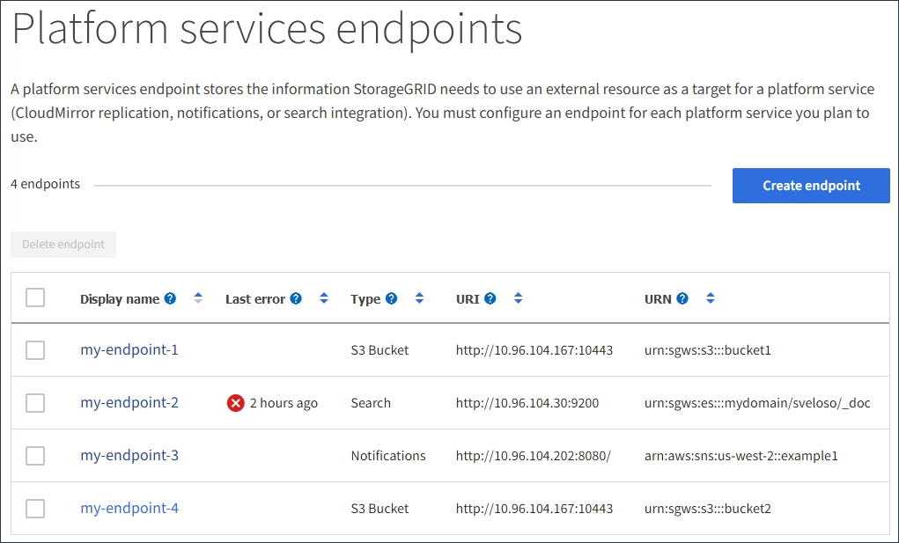
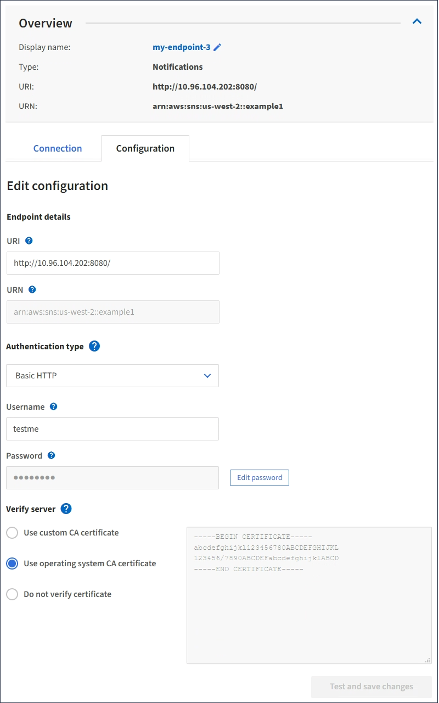

= Edit platform services endpoint
:icons: font
:imagesdir: ../media/

[.lead]
You can edit the configuration for a platform services endpoint to change its name, URI, or other details. For example, you might need to update expired credentials or change the URI to point to a backup Elasticsearch index for failover. You cannot change the URN for a platform services endpoint.

.What you'll need

* You must be signed in to the Tenant Manager using a xref:../admin/web-browser-requirements.adoc[supported web browser].
* You must belong to a user group that has the Manage Endpoints permission. See xref:tenant-management-permissions.adoc[Tenant management permissions].

.Steps

. Select *STORAGE (S3)* > *Platform services endpoints*.
+
The Platform services endpoints page appears and shows the list of platform services endpoints that have already been configured.
+

. Select the endpoint you want to edit.
+
The endpoint details page appears.

. Select *Configuration*.
+

. As needed, change the configuration of the endpoint.
+
NOTE: You cannot change an endpoint's URN after the endpoint has been created.

 .. To change the display name for the endpoint, select the edit icon .
 .. As needed, change the URI.
 .. As needed, change the authentication type.
  *** For Access Key authentication, change the key as necessary by selecting *Edit S3 key* and pasting a new access key ID and secret access key. If you need to cancel your changes, select *Revert S3 key edit*.
  *** For Basic HTTP authentication, change the username as needed. Change the password as needed by selecting *Edit password* and entering the new password. If you need to cancel your changes, select *Revert password edit*.
  *** For CAP (C2S Access Portal) authentication, change the temporary credentials URL or optional client private key passphrase and upload new certificate and key files as needed.
+
NOTE: The Client private key must be in OpenSSL encrypted format or unencrypted private key format.

 .. As needed, change the method for verifying the server.

. Select *Test and save changes*.
 ** A success message appears if the endpoint can be reached using the specified credentials. The connection to the endpoint is verified from one node at each site.
 ** An error message appears if endpoint validation fails. Modify the endpoint to correct the error, and then select *Test and save changes*.
