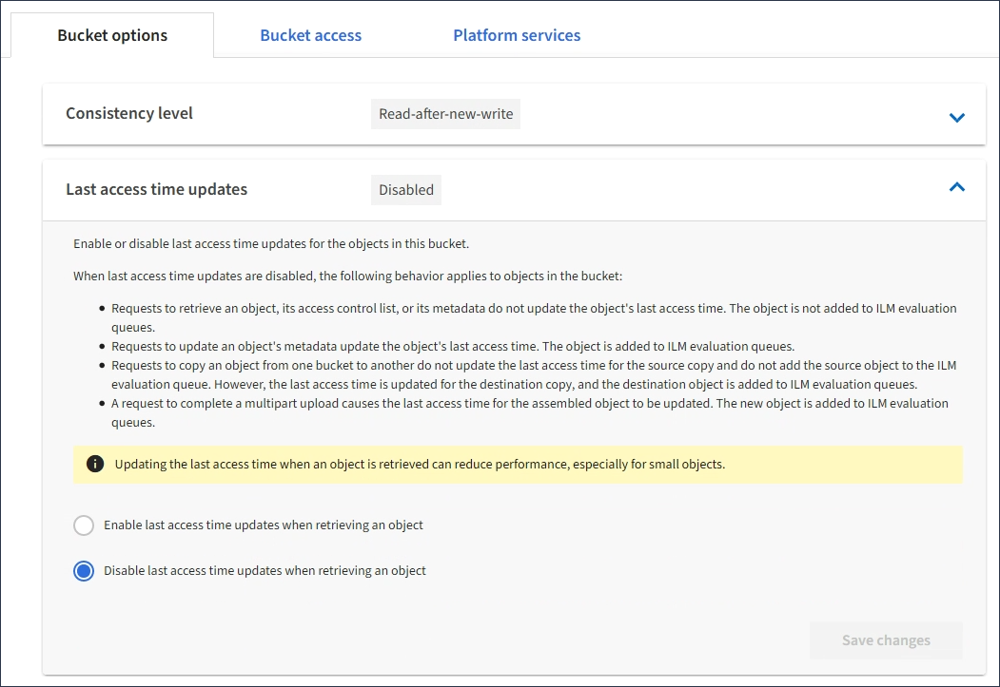

= Enable or disable last access time updates
:icons: font
:imagesdir: ../media/

[.lead]
When grid administrators create the information lifecycle management (ILM) rules for a StorageGRID system, they can optionally specify that an object's last access time be used to determine whether to move that object to a different storage location. If you are using an S3 tenant, you can take advantage of such rules by enabling last access time updates for the objects in an S3 bucket.

These instructions only apply to StorageGRID systems that include at least one ILM rule that uses the *Last Access Time* option in its placement instructions. You can ignore these instructions if your StorageGRID system does not include such a rule.

.What you'll need

* You must be signed in to the Tenant Manager using a xref:../admin/web-browser-requirements.adoc[supported web browser].
* You must belong to a user group that has the Manage All Buckets or the Root Access permission. These permissions override the permissions settings in group or bucket policies. See xref:tenant-management-permissions.adoc[Tenant management permissions].

*Last Access Time* is one of the options available for the *Reference Time* placement instruction for an ILM rule. Setting the Reference Time for a rule to Last Access Time lets grid administrators specify that objects be placed in certain storage locations based on when those objects were last retrieved (read or viewed).

For example, to ensure that recently viewed objects remain on faster storage, a grid administrator can create an ILM rule specifying the following:

* Objects that have been retrieved in the past month should remain on local Storage Nodes.
* Objects that have not been retrieved in the past month should be moved to an off-site location.

NOTE: See the instructions for managing objects with information lifecycle management.

By default, updates to last access time are disabled. If your StorageGRID system includes an ILM rule that uses the *Last Access Time* option and you want this option to apply to objects in this bucket, you must enable updates to last access time for the S3 buckets specified in that rule.

IMPORTANT: Updating the last access time when an object is retrieved can reduce StorageGRID performance, especially for small objects.

A performance impact occurs with last access time updates because StorageGRID must perform these additional steps every time objects are retrieved:

* Update the objects with new timestamps
* Add the objects to the ILM queue, so they can be reevaluated against current ILM rules and policy

The table summarizes the behavior applied to all objects in the bucket when last access time is disabled or enabled.

[cols="1a,1a,1a,1a,1a"]
|===
.2+h|Type of request
2+h|Behavior if last access time is disabled (default)
2+h|Behavior if last access time is enabled

h|Last access time updated?
h|Object added to ILM evaluation queue?
h|Last access time updated?
h|Object added to ILM evaluation queue?

|Request to retrieve an object, its access control list, or its metadata
|No
|No
|Yes
|Yes

|Request to update an object's metadata
|Yes
|Yes
|Yes
|Yes

|Request to copy an object from one bucket to another
|
* No, for the source copy
* Yes, for the destination copy

|
* No, for the source copy
* Yes, for the destination copy

|
* Yes, for the source copy
* Yes, for the destination copy

|
* Yes, for the source copy
* Yes, for the destination copy

|Request to complete a multipart upload
|Yes, for the assembled object
|Yes, for the assembled object
|Yes, for the assembled object
|Yes, for the assembled object
|===

.Steps
. Select *STORAGE (S3)* > *Buckets*.
. Select the bucket name from the list.
+
The bucket details page appears.

. Select *Bucket options* > *Last access time updates*.
. Select the appropriate radio button to enable or disable last access time updates.
+

. Select *Save changes*.

.Related information

xref:tenant-management-permissions.adoc[Tenant management permissions]

xref:../ilm/index.adoc[Manage objects with ILM]
