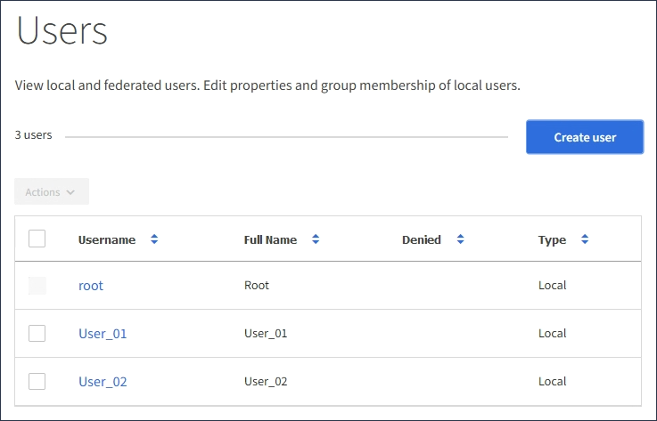

= Manage local users
:icons: font
:imagesdir: ../media/

[.lead]
You can create local users and assign them to local groups to determine which features these users can access. The Tenant Manager includes one predefined local user, named "`root.`" Although you can add and remove local users, you cannot remove the root user.

.What you'll need

* You must be signed in to the Tenant Manager using a xref:../admin/web-browser-requirements.adoc[supported web browser].
* You must belong to a read-write user group that has the Root Access permission. See xref:tenant-management-permissions.adoc[Tenant management permissions].

NOTE: If single sign-on (SSO) is enabled for your StorageGRID system, local users will not be able to sign in to the Tenant Manager or the Tenant Management API, although they can use S3 or Swift client applications to access the tenant's resources, based on group permissions.

== Access Users page

Select *ACCESS MANAGEMENT* > *Users*.

== Create local users

You can create local users and assign them to one or more local groups to control their access permissions.

S3 users who do not belong to any groups do not have management permissions or S3 group policies applied to them. These users might have S3 bucket access granted through a bucket policy.

Swift users who do not belong to any groups do not have management permissions or Swift container access.

.Steps
. Select *Create user*.
. Complete the following fields.
 ** *Full name*: The full name for this user, for example, the first name and last name of a person or the name of an application.
 ** *Username*: The name this user will use to sign in. Usernames must be unique and cannot be changed.
 ** *Password*: A password, which is used when the user signs in.
 ** *Confirm password*: Type the same password you typed in the Password field.
 ** *Deny access*: If you select *Yes*, this user cannot sign in to the tenant account, even though the user might still belong to one or more groups.
+
As an example, you can use this feature to temporarily suspend a user's ability to sign in.
. Select *Continue*.
. Assign the user to one or more local groups.
+
Users who do not belong to any groups will have no management permissions. Permissions are cumulative. Users will have all permissions for all groups they belong to.

. Select *Create user*.
+
Changes might take up to 15 minutes to take effect because of caching.

== Edit user details

When you edit the details for a user, you can change the user's full name and password, add the user to different groups, and prevent the user from accessing the tenant.

.Steps
. In the Users list, select the name of the user whose details you want to view or edit.
+
Alternatively, you can select the check box for the user, and then select *Actions* > *View user details*.

. Make changes to the user settings as needed.
 .. Change the user's full name as needed by selecting the full name or the edit icon image:../media/icon_edit_tm.png[Edit icon] in the Overview section.
+
You cannot change the username.

 .. On the *Password* tab, change the user's password as needed.
 .. On the *Access* tab, allow the user to sign in (select *No*), or prevent the user from signing in (select *Yes*) as needed.
 .. On the *Groups* tab, add the user to groups or remove the user from groups as needed.
 .. As necessary for each section, select *Save changes*.
+
Changes might take up to 15 minutes to take effect because of caching.

== Duplicate local users

You can duplicate a local user to create a new user more quickly.

.Steps
. In the Users list, select the user you want to duplicate.
. Select *Duplicate user*.
. Modify the following fields for the new user.
 ** *Full name*: The full name for this user, for example, the first name and last name of a person or the name of an application.
 ** *Username*: The name this user will use to sign in. Usernames must be unique and cannot be changed.
 ** *Password*: A password, which is used when the user signs in.
 ** *Confirm password*: Type the same password you typed in the Password field.
 ** *Deny access*: If you select *Yes*, this user cannot sign in to the tenant account, even though the user might still belong to one or more groups.
+
As an example, you can use this feature to temporarily suspend a user's ability to sign in.
. Select *Continue*.
. Select one or more local groups.
+
Users who do not belong to any groups will have no management permissions. Permissions are cumulative. Users will have all permissions for all groups they belong to.

. Select *Create user*.
+
Changes might take up to 15 minutes to take effect because of caching.

== Delete local users

You can permanently delete local users who no longer need to access the StorageGRID tenant account.

Using the Tenant Manager, you can delete local users, but not federated users. You must use the federated identity source to delete federated users.

.Steps
. In the Users list, select the check box for the local user you want to delete.
. Select *Actions* > *Delete user*.
. In the confirmation dialog box, select *Delete user* to confirm you want to delete the user from the system.
+
Changes might take up to 15 minutes to take effect because of caching.