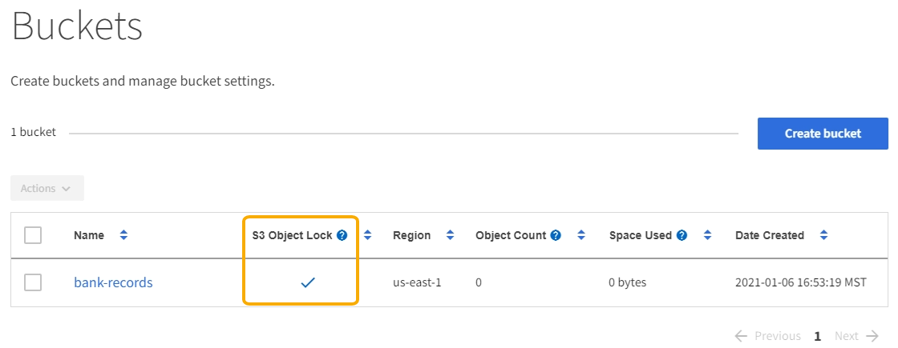

= Requirements for S3 Object Lock
:icons: font
:imagesdir: ../media/

[.lead]
Before enabling S3 Object Lock for a bucket, review the requirements for S3 Object Lock buckets and objects and the lifecycle of objects in buckets with S3 Object Lock enabled.

== Requirements for buckets with S3 Object Lock enabled

* If the global S3 Object Lock setting is enabled for the StorageGRID system, you can use the Tenant Manager, the Tenant Management API, or the S3 REST API to create buckets with S3 Object Lock enabled.
+
This example from the Tenant Manager shows a bucket with S3 Object Lock enabled.
+

* If you plan to use S3 Object Lock, you must enable S3 Object Lock when you create the bucket. You cannot enable S3 Object Lock for an existing bucket.
* Bucket versioning is required with S3 Object Lock. When S3 Object Lock is enabled for a bucket, StorageGRID automatically enables versioning for that bucket.
* After you create a bucket with S3 Object Lock enabled, you cannot disable S3 Object Lock or suspend versioning for that bucket.
* An StorageGRID bucket that has S3 Object Lock enabled does not have a default retention period. Instead, the S3 client application can optionally specify a retention date and legal hold setting for each object version that is added to that bucket.
* Bucket lifecycle configuration is supported for S3 Object Lifecycle buckets.
* CloudMirror replication is not supported for buckets with S3 Object Lock enabled.

== Requirements for objects in buckets with S3 Object Lock enabled

* The S3 client application must specify retention settings for each object that needs to be protected by S3 Object Lock.
* You can increase the retain-until-date for an object version, but you can never decrease this value.
* If you are notified of a pending legal action or regulatory investigation, you can preserve relevant information by placing a legal hold on an object version. When an object version is under a legal hold, that object cannot be deleted from StorageGRID, even if it has reached its retain-until-date. As soon as the legal hold is lifted,the object version can be deleted if the retain-until-date has been reached.
* S3 Object Lock requires the use of versioned buckets. Retention settings apply to individual object versions. An object version can have both a retain-until-date and a legal hold setting, one but not the other, or neither. Specifying a retain-until-date or a legal hold setting for an object protects only the version specified in the request. You can create new versions of the object, while the previous version of the object remains locked.

== Lifecycle of objects in buckets with S3 Object Lock enabled

Each object that is saved in a bucket with S3 Object Lock enabled goes through three stages:

. *Object ingest*
 ** When adding an object version to a bucket with S3 Object Lock enabled, the S3 client application can optionally specify retention settings for the object (retain-until-date, legal hold, or both). StorageGRID then generates metadata for that object, which includes a unique object identifier (UUID) and the ingest date and time.
 ** After an object version with retention settings is ingested, its data and S3 user-defined metadata cannot be modified.
 ** StorageGRID stores the object metadata independently of the object data. It maintains three copies of all object metadata at each site.
. *Object retention*
 ** Multiple copies of the object are stored by StorageGRID. The exact number and type of copies and the storage locations are determined by the compliant rules in the active ILM policy.
. *Object deletion*
 ** An object can be deleted when its retain-until-date is reached.
 ** An object that is under a legal hold cannot be deleted.
