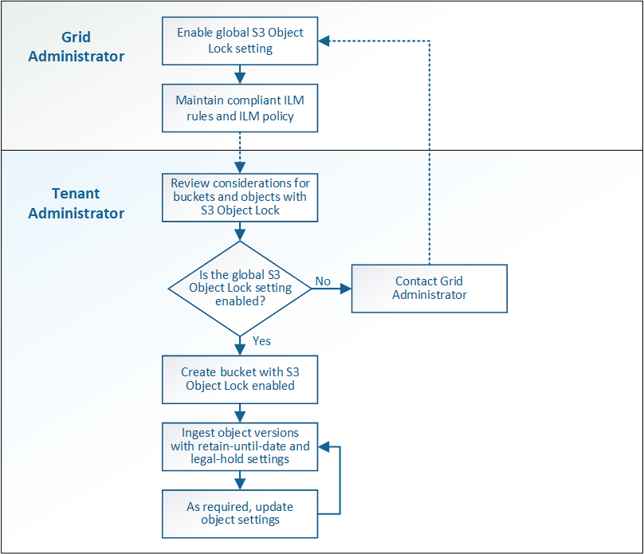

= S3 Object Lock workflow
:icons: font
:imagesdir: ../media/

[.lead]
The workflow diagram shows the high-level steps for using the S3 Object Lock feature in StorageGRID.

Before you can create buckets with S3 Object Lock enabled, the grid administrator must enable the global S3 Object Lock setting for the entire StorageGRID system. The grid administrator must also ensure that the information lifecycle management (ILM) policy is "`compliant`"; it must meet the requirements of buckets with S3 Object Lock enabled. For details, contact your grid administrator or see the instructions for managing objects with information lifecycle management.

After the global S3 Object Lock setting has been enabled, you can create buckets with S3 Object Lock enabled. You can then use the S3 client application to optionally specify retention settings for each object version.

.Related information

xref:../ilm/index.adoc[Manage objects with ILM]
