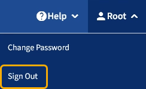

= Signing out of the Tenant Manager
:icons: font
:imagesdir: ../media/

[.lead]
When you are done working with the Tenant Manager, you must sign out to ensure that unauthorized users cannot access the StorageGRID system. Closing your browser might not sign you out of the system, based on browser cookie settings.

.Steps

. Locate the username drop-down in the top-right corner of the user interface.
+

. Select the username and then select *Sign Out*.
+
[cols="1a,2a" options="header"]
|===
| Option| Description
|SSO not in use
|You are signed out of the Admin Node.     The Tenant Manager sign in page is displayed.

*Note:* If you signed into more than one Admin Node, you must sign out of each node.

|SSO enabled
|You are signed out of all Admin Nodes you were accessing.     The StorageGRID Sign in page is displayed. The name of the tenant account you just accessed is listed as the default in the *Recent Accounts* drop-down, and the tenant's *Account ID* is shown.

*Note:* If SSO is enabled and you are also signed in to the Grid Manager, you must also sign out of the Grid Manager to sign out of SSO.
|===
