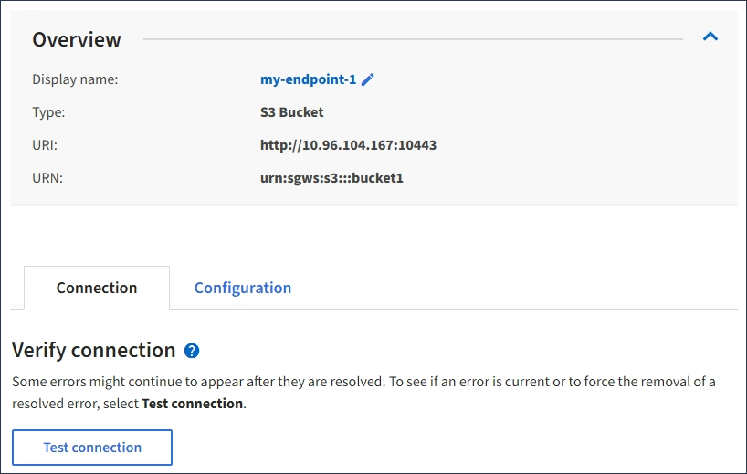

= Test connection for platform services endpoint
:icons: font
:imagesdir: ../media/

[.lead]
If the connection to a platform service has changed, you can test the connection for the endpoint to validate that the destination resource exists and that it can be reached using the credentials you specified.

.What you'll need

* You must be signed in to the Tenant Manager using a xref:../admin/web-browser-requirements.adoc[supported web browser].
* You must belong to a user group that has the Manage Endpoints permission.

.About this task

StorageGRID does not validate that the credentials have the correct permissions.

.Steps

. Select *STORAGE (S3)* > *Platform services endpoints*.
+
The Platform services endpoints page appears and shows the list of platform services endpoints that have already been configured.
+
image::../media/endpoints_list.png[Endpoints List]

. Select the endpoint whose connection you want to test.
+
The endpoint details page appears.
+

. Select *Test connection*.
 ** A success message appears if the endpoint can be reached using the specified credentials. The connection to the endpoint is validated from one node at each site.
 ** An error message appears if endpoint validation fails. If you need to modify the endpoint to correct the error, select *Configuration* and update the information. Then, select *Test and save changes*.
