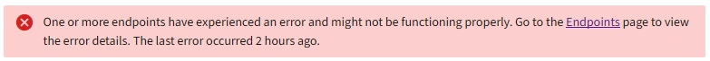
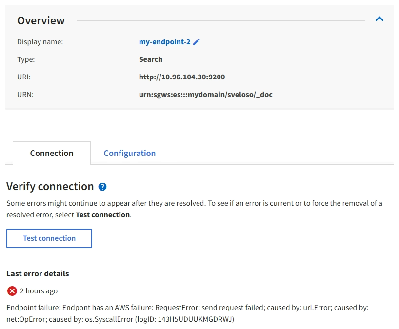

= Troubleshooting platform services endpoint errors
:icons: font
:imagesdir: ../media/

[.lead]
If an error occurs when StorageGRID attempts to communicate with a platform services endpoint, a message is displayed on the Dashboard. On the Platform services endpoints page, the Last error column indicates how long ago the error occurred. No error is displayed if the permissions associated with an endpoint's credentials are incorrect.

== Determining if an error has occurred

If any platform services endpoint errors have occurred within the past 7 days, the Tenant Manager Dashboard displays an alert message. You can go the Platform services endpoints page to see more details about the error.

The same error that appears on the Dashboard also appears at the top of the Platform services endpoints page. To view a more detailed error message:

.Steps

. From the list of endpoints, select the endpoint that has the error.
. On the endpoint details page, select *Connection*. This tab displays only the most recent error for an endpoint and indicates how long ago the error occurred. Errors that include the red X icon  occurred within the past 7 days.

== Checking if an error is still current

Some errors might continue to be shown in the *Last error* column even after they are resolved. To see if an error is current or to force the removal of a resolved error from the table:

.Steps

. Select the endpoint.
+
The endpoint details page appears.

. Select *Connection* > *Test connection*.

Selecting *Test connection* causes StorageGRID to validate that the platform services endpoint exists and that it can be reached with the current credentials. The connection to the endpoint is validated from one node at each site.

== Resolving endpoint errors

You can use the *Last error* message on the endpoint details page to help determine what is causing the error. Some errors might require you to edit the endpoint to resolve the issue. For example, a CloudMirroring error can occur if StorageGRID is unable to access the destination S3 bucket because it does not have the correct access permissions or the access key has expired. The message is "`Either the endpoint credentials or the destination access needs to be updated,`" and the details are "`AccessDenied`" or "`InvalidAccessKeyId.`"

If you need to edit the endpoint to resolve an error:, selecting *Test and save changes* causes StorageGRID to validate the updated endpoint and confirm that it can be reached with the current credentials. The connection to the endpoint is validated from one node at each site.

.Steps

. Select the endpoint.
. On the endpoint details page, select *Configuration*.
. Edit the endpoint configuration as needed.
. Select *Connection* > *Test connection*.

== Endpoint credentials with insufficient permissions

When StorageGRID validates a platform services endpoint, it confirms that the endpoint's credentials can be used to contact the destination resource and it does a basic permissions check. However, StorageGRID does not validate all of the permissions required for certain platform services operations. For this reason, if you receive an error when attempting to use a platform service (such as "`403 Forbidden`"), check the permissions associated with the endpoint's credentials.

== Additional platform services troubleshooting

For additional information about troubleshooting platform services, see the instructions for administering StorageGRID.

xref:../admin/index.adoc[Administer StorageGRID]

.Related information

xref:creating-platform-services-endpoint.adoc[Creating a platform services endpoint]

xref:testing-connection-for-platform-services-endpoint.adoc[Testing the connection for a platform services endpoint]

xref:editing-platform-services-endpoint.adoc[Editing a platform services endpoint]
