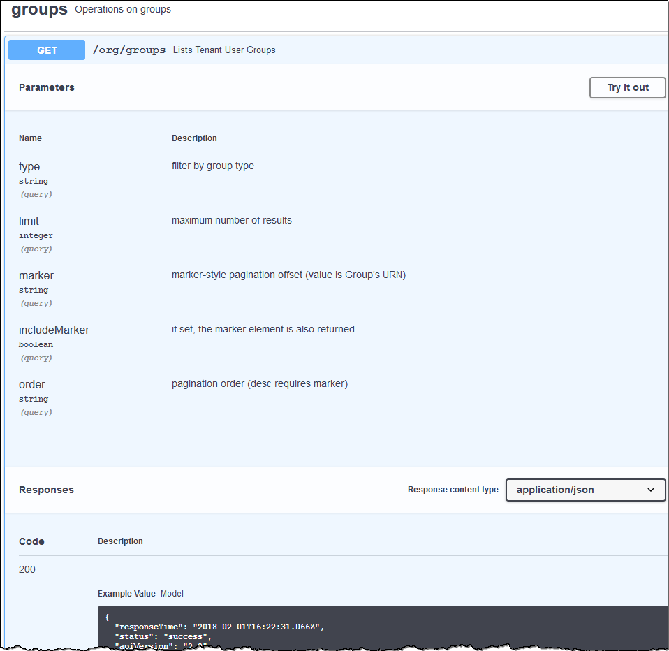

= Understanding the Tenant Management API
:icons: font
:imagesdir: ../media/

[.lead]
You can perform system management tasks using the Tenant Management REST API instead of the Tenant Manager user interface. For example, you might want to use the API to automate operations or to create multiple entities, such as users, more quickly.

The Tenant Management API uses the Swagger open source API platform. Swagger provides an intuitive user interface that allows developers and non-developers to interact with the API. The Swagger user interface provides complete details and documentation for each API operation.

To access the Swagger documentation for the Tenant Management API:

.Steps

. Sign in to the Tenant Manager.
. Select *Help* > *API Documentation* from the Tenant Manager header.

== API operations

The Tenant Management API organizes the available API operations into the following sections:

* *account* -- Operations on the current tenant account, including getting storage usage information.
* *auth* -- Operations to perform user session authentication.
+
The Tenant Management API supports the Bearer Token Authentication Scheme. For a tenant login, you provide a username, password, and accountId in the JSON body of the authentication request (that is, `POST /api/v3/authorize`). If the user is successfully authenticated, a security token is returned. This token must be provided in the header of subsequent API requests ("Authorization: Bearer token").
+
See "`Protecting against Cross-Site Request Forgery`" for information on improving authentication security.
+
NOTE: If single sign-on (SSO) is enabled for the StorageGRID system, you must perform different steps to authenticate. See "`Authenticating in to the API if single sign-on is enabled`" in the instructions for administering StorageGRID.

* *config* -- Operations related to the product release and versions of the Tenant Management API. You can list the product release version and the major versions of the API supported by that release.
* *containers* -- Operations on S3 buckets or Swift containers, as follows:
+
[cols="1a,3a" options="header"]
|===
| Protocol| Permission allows
a|
S3
a|

 ** Creating compliant and non-compliant buckets
 ** Modifying legacy compliance settings
 ** Setting the consistency control for operations performed on objects
 ** Creating, updating, and deleting a bucket's CORS configuration
 ** Enabling and disabling last access time updates for objects
 ** Managing the configuration settings for platform services, including CloudMirror replication, notifications, and search integration (metadata-notification)
 ** Deleting empty buckets

a|
Swift
a|
Setting the consistency level used for containers
|===

* *deactivated-features* -- Operations to view features that might have been deactivated.
* *endpoints* -- Operations to manage an endpoint. Endpoints allow an S3 bucket to use an external service for StorageGRID CloudMirror replication, notifications, or search integration.
* *groups* -- Operations to manage local tenant groups and to retrieve federated tenant groups from an external identity source.
* *identity-source* -- Operations to configure an external identity source and to manually synchronize federated group and user information.
* *regions* -- Operations to determine which regions have been configured for the StorageGRID system.
* *s3* -- Operations to manage S3 access keys for tenant users.
* *s3-object-lock* -- Operations to determine how global S3 Object Lock (compliance) is configured for the StorageGRID system.
* *users* -- Operations to view and manage tenant users.

== Operation details

When you expand each API operation, you can see its HTTP action, endpoint URL, a list of any required or optional parameters, an example of the request body (when required), and the possible responses.

== Issuing API requests

IMPORTANT: Any API operations you perform using the API Docs webpage are live operations. Be careful not to create, update, or delete configuration data or other data by mistake.

.Steps
. Click the HTTP action to see the request details.
. Determine if the request requires additional parameters, such as a group or user ID. Then, obtain these values. You might need to issue a different API request first to get the information you need.
. Determine if you need to modify the example request body. If so, you can click *Model* to learn the requirements for each field.
. Click *Try it out*.
. Provide any required parameters, or modify the request body as required.
. Click *Execute*.
. Review the response code to determine if the request was successful.

.Related information

xref:protecting-against-cross-site-request-forgery-csrf.adoc[Protecting against Cross-Site Request Forgery (CSRF)]

xref:../admin/index.adoc[Administer StorageGRID]
