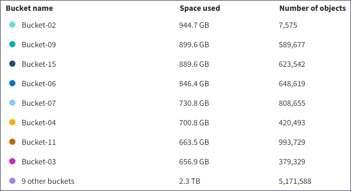
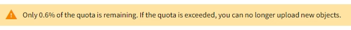
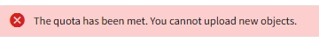

= Understanding the Tenant Manager Dashboard
:icons: font
:imagesdir: ../media/

[.lead]
The Tenant Manager Dashboard provides an overview of a tenant account's configuration and the amount of space used by objects in the tenant's buckets (S3) or containers (Swift). If the tenant has a quota, the Dashboard shows how much of the quota is used and how much is remaining. If there are any errors related to the tenant account, the errors are shown on the Dashboard.

IMPORTANT: The Space used values are estimates. These estimates are affected by the timing of ingests, network connectivity, and node status.

When objects have been uploaded, the Dashboard looks like the following example:

image::../media/tenant_dashboard_with_buckets.png[Dashboard - Bucket List]

== Tenant account summary

The top of the Dashboard contains the following information:

* The number of configured buckets or containers, groups, and users
* The number of platform services endpoints, if any have been configured

You can select the links to view the details.

The right side of the Dashboard contains the following information:

* The total number of objects for the tenant.
+
For an S3 account, if no objects have been ingested and you have the Root Access permission, getting started guidelines appear instead of the total number of objects.

* The tenant account name and ID.
* A link to the StorageGRID documentation.

== Storage and quota usage

The Storage usage panel contains the following information:

* The amount of object data for the tenant.
+
IMPORTANT: This value indicates the total amount of object data uploaded and does not represent the space used to store copies of those objects and their metadata.

* If a quota is set, the total amount of space available for object data and the amount and percentage of space remaining. The quota limits the amount of object data that can be ingested.
+
IMPORTANT: Quota utilization is based on internal estimates and might be exceeded in some cases. For example, StorageGRID checks the quota when a tenant starts uploading objects and rejects new ingests if the tenant has exceeded the quota. However, StorageGRID does not take into account the size of the current upload when determining if the quota has been exceeded. If objects are deleted, a tenant might be temporarily prevented from uploading new objects until the quota utilization is recalculated. Quota utilization calculations can take 10 minutes or longer.

* A bar chart that represents the relative sizes of the largest buckets or containers.
+
You can place your cursor over any of the chart segments to view the total space consumed by that bucket or container.
+
image::../media/tenant_dashboard_storage_usage_segment.png[Bar Chart Segment]

* To correspond with the bar chart, a list of the largest buckets or containers, including the total amount of object data and the number of objects for each bucket or container.
+

+
If the tenant has more than nine buckets or containers, all other buckets or containers are combined into a single entry at the bottom of the list.

== Quota usage alerts

If quota usage alerts have been enabled in the Grid Manager, they will appear in the Tenant Manager when the quota is low or exceeded, as follows:

If 90% or more of a tenant's quota has been used, the *Tenant quota usage high* alert is triggered. For more information, see the alerts reference in the instructions for monitoring and troubleshooting StorageGRID.

If you exceed your quota, you cannot upload new objects.

NOTE: To view additional details and manage rules and notifications for alerts, see the instructions for monitoring and troubleshooting StorageGRID.

== Endpoint errors

If you have used the Grid Manager to configure one or more endpoints for use with platform services, the Tenant Manager Dashboard displays an alert if any endpoint errors have occurred within the past seven days.

image::../media/tenant_dashboard_endpoint_error.png[Dashboard showing endpoint message]

To see details about an endpoint error, select Endpoints to display the Endpoints page.

.Related information

xref:troubleshooting-platform-services-endpoint-errors.adoc[Troubleshooting platform services endpoint errors]

xref:../monitor/index.adoc[Monitor & troubleshoot]
