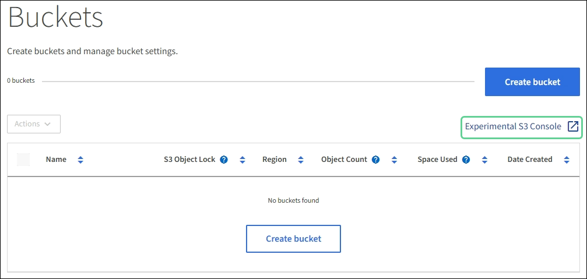

= Use S3 Console (Experimental)
:icons: font
:imagesdir: ../media/

[.lead]
You can use S3 Console to view the objects in an S3 bucket. S3 Console is experimental and has not been fully tested.

You can use this experimental tool primarily to view the objects in an S3 bucket. You can also do the following:

* Add and delete objects and object versions
* Rename objects
* Move and copy objects between buckets
* Manage object tags

The experimental S3 Console tool is not intended for bulk management of objects or for use in a production environment. Instead, use S3 Console when you need to perform these functions for a small number of objects, such as when you are uploading objects to simulate a new ILM policy, troubleshooting ingest issues, or using proof-of-concept or non-production grids.

.What you'll need

* You are signed in to the Tenant Manager using a xref:../admin/web-browser-requirements.adoc[supported web browser].
* You have the Manage Your Own S3 Credentials permission.
* You have created a bucket.
* If you do not already have an access key and secret key for the user, you have created a key and downloaded the .csv file from the My access keys page.

.Steps

. Select *Buckets*.
. Select *Experimental S3 Console*. You can also access this link from the bucket details page.
+

+
. On the Experimental S3 Console sign-in page, select *Upload access keys*.
. Browse to and select the .csv file containing the key.
. Select *Sign in*.
