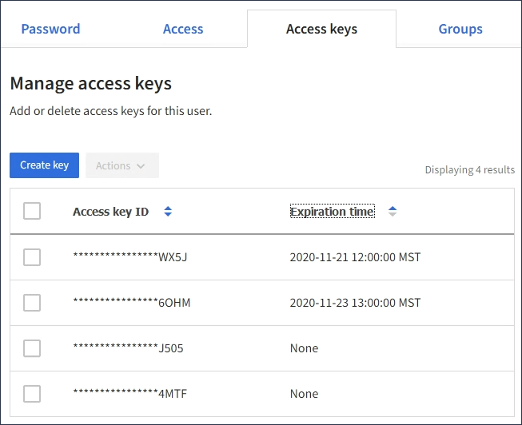

= View another user's S3 access keys
:icons: font
:imagesdir: ../media/

[.lead]
If you are using an S3 tenant and you have appropriate permissions, you can view another user's S3 access keys. You can sort the list by expiration time so you can determine which keys will expire soon. As needed, you can create new keys and delete keys that are no longer in use.

.What you'll need

* You must be signed in to the Tenant Manager using a xref:../admin/web-browser-requirements.adoc[supported web browser].
* You must have the Root Access permission.

IMPORTANT: The S3 buckets and objects belonging to a user can be accessed using the access key ID and secret access key displayed for that user in the Tenant Manager. For this reason, protect access keys as you would a password. Rotate access keys on a regular basis, remove any unused keys from the account, and never share them with other users.

.Steps
. Select *ACCESS MANAGEMENT* > *Users*.
+
The Users page appears and lists the existing users.

. Select the user whose S3 access keys you want to view.
+
The User details page appears.

. Select *Access keys*.
+

. Sort the keys by *Expiration time* or *Access key ID*.
. As needed, create new keys and manually delete keys that the are no longer in use.
+
If you create new keys before the existing keys expire, the user can begin using the new keys without temporarily losing access to the objects in the account.
+
Expired keys are removed automatically.

.Related information

xref:creating-another-users-s3-access-keys.adoc[Create another user's S3 access keys]

xref:deleting-another-users-s3-access-keys.adoc[Delete another user's S3 access keys]
