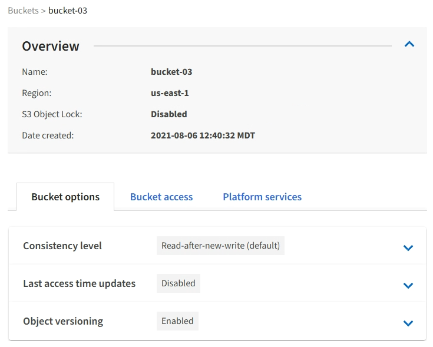

= View S3 bucket details
:icons: font
:imagesdir: ../media/

[.lead]
You can view a list of the buckets and bucket settings in your tenant account.

.What you'll need

* You must be signed in to the Tenant Manager using a xref:../admin/web-browser-requirements.adoc[supported web browser].

.Steps
. Select *STORAGE (S3)* > *Buckets*.
+
The Buckets page appears and lists all buckets for the tenant account.
+
image::../media/buckets_table.png[Buckets Table]

. Review the information for each bucket.
+
As required, you can sort the information by any column, or you can page forward and back through the list.

 ** Name: The bucket's unique name, which cannot be changed.
 ** S3 Object Lock: Whether S3 Object Lock is enabled for this bucket.
+
This column is not displayed if the global S3 Object lock setting is disabled. This column also shows information for any legacy Compliant buckets.

 ** Region: The bucket's region, which cannot be changed.
 ** Object Count: The number of objects in this bucket.
 ** Space Used: The logical size of all objects in this bucket. The logical size does not include the actual space required for replicated or erasure-coded copies or for object metadata.
 ** Date Created: The date and time the bucket was created.

+
IMPORTANT: The Object Count and Space Used values displayed are estimates. These estimates are affected by the timing of ingests, network connectivity, and node status. If buckets have versioning enabled, deleted object versions are included in the object count.

. To view and manage the settings for a bucket, select the bucket name.
+
The bucket details page allows you to view and edit the settings for bucket options, bucket access, and xref:what-platform-services-are.adoc[platform services].
+

