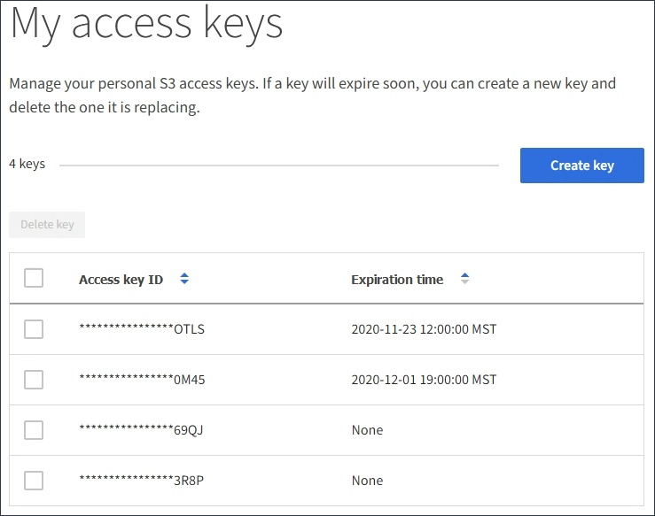

= Viewing your S3 access keys
:icons: font
:imagesdir: ../media/

[.lead]
If you are using an S3 tenant and you have the appropriate permission, you can view a list of your S3 access keys. You can sort the list by expiration time, so you can determine which keys will expire soon. As needed, you can create new keys or delete keys that you are no longer using.

.What you'll need

* You must be signed in to the Tenant Manager using a xref:../admin/web_browser_requirements.adoc[supported web browser].
* You must have the Manage Your Own S3 Credentials permission.

IMPORTANT: The S3 buckets and objects belonging to your account can be accessed using the access key ID and secret access key displayed for your account in the Tenant Manager. For this reason, protect access keys as you would a password. Rotate access keys on a regular basis, remove any unused keys from your account, and never share them with other users.

.Steps

. Select *STORAGE (S3)* > *My access keys*.
+
The My access keys page appears and lists any existing access keys.
+

. Sort the keys by *Expiration time* or *Access key ID*.
. As needed, create new keys and manually delete keys that you are no longer using.
+
If you create new keys before the existing keys expire, you can begin using the new keys without temporarily losing access to the objects in the account.
+
Expired keys are removed automatically.

.Related information

xref:creating_your_own_s3_access_keys.adoc[Creating your own S3 access keys]

xref:deleting_your_own_s3_access_keys.adoc[Deleting your own S3 access keys]
