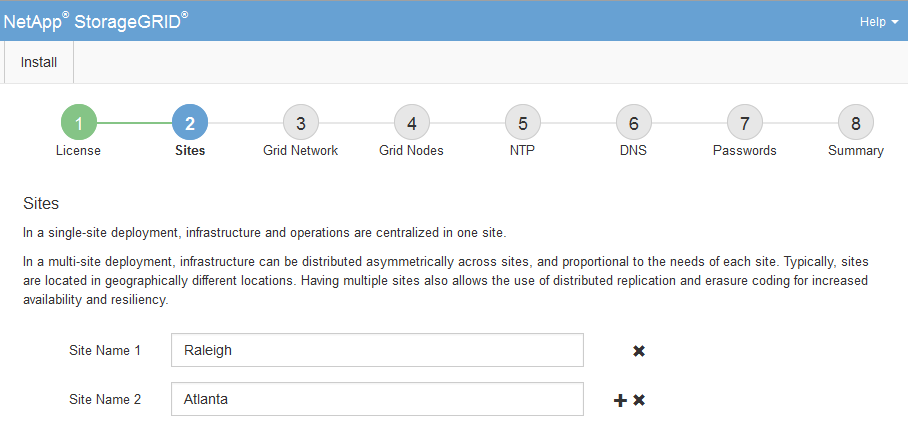

= Adding sites
:icons: font
:imagesdir: ../media/

[.lead]
You must create at least one site when you are installing StorageGRID. You can create additional sites to increase the reliability and storage capacity of your StorageGRID system.

. On the Sites page, enter the *Site Name*.
. To add additional sites, click the plus sign next to the last site entry and enter the name in the new *Site Name* text box.
+
Add as many additional sites as required for your grid topology. You can add up to 16 sites.
+

. Click *Next*.
