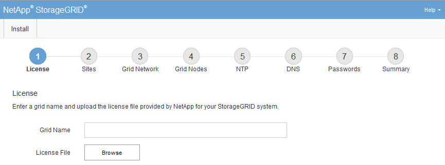

= Navigating to the Grid Manager
:icons: font
:imagesdir: ../media/

[.lead]
You use the Grid Manager to define all of the information required to configure your StorageGRID system.

.What you'll need

The primary Admin Node must be deployed and have completed the initial startup sequence.

.Steps

. Open your web browser and navigate to one of the following addresses:

----
https://primary_admin_node_ip

client_network_ip
----

Alternatively, you can access the Grid Manager on port 8443:

----
https://primary_admin_node_ip:8443
----

NOTE: You can use the IP address for the primary Admin Node IP on the Grid Network or on the Admin Network, as appropriate for your network configuration.

. Click *Install a StorageGRID system*.
+
The page used to configure a StorageGRID grid appears.
+

