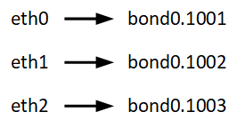
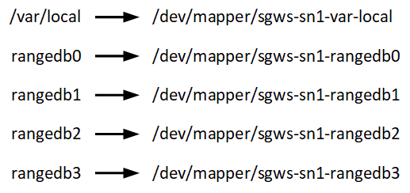

= Node container migration requirements
:icons: font
:imagesdir: ../media/

[.lead]
The node migration feature allows you to manually move a node from one host to another. Typically, both hosts are in the same physical data center.

Node migration allows you to perform physical host maintenance without disrupting grid operations. You simply move all StorageGRID nodes, one at a time, to another host before taking the physical host offline. Migrating nodes requires only a short downtime for each node and should not affect operation or availability of grid services.

If you want to use the StorageGRID node migration feature, your deployment must meet additional requirements:

* Consistent network interface names across hosts in a single physical data center
* Shared storage for StorageGRID metadata and object repository volumes that is accessible by all hosts in a single physical data center. For example, you might use NetApp E-Series storage arrays.

If you are using virtual hosts and the underlying hypervisor layer supports VM migration, you might want to use this capability instead of StorageGRID's node migration feature. In this case, you can ignore these additional requirements.

Before performing migration or hypervisor maintenance, shut down the nodes gracefully. See the recovery and maintenance instructions for shutting down a grid node.

== VMware Live Migration not supported

OpenStack Live Migration and VMware live vMotion cause the virtual machine clock time to jump and are not supported for grid nodes of any type. Though rare, incorrect clock times can result in loss of data or configuration updates.

Cold migration is supported. In cold migration, you shut down the StorageGRID nodes before migrating them between hosts. See the procedure for shutting down a grid node in the recovery and maintenance instructions.

== Consistent network interface names

In order to move a node from one host to another, the StorageGRID host service needs to have some confidence that the external network connectivity the node has at its current location can be duplicated at the new location. It gets this confidence through the use of consistent network interface names in the hosts.

Suppose, for example, that StorageGRID NodeA running on Host1 has been configured with the following interface mappings:

The lefthand side of the arrows corresponds to the traditional interfaces as viewed from within a StorageGRID container (that is, the Grid, Admin, and Client Network interfaces, respectively). The righthand side of the arrows corresponds to the actual host interfaces providing these networks, which are three VLAN interfaces subordinate to the same physical interface bond.

Now, suppose you want to migrate NodeA to Host2. If Host2 also has interfaces named bond0.1001, bond0.1002, and bond0.1003, the system will allow the move, assuming that the like-named interfaces will provide the same connectivity on Host2 as they do on Host1. If Host2 does not have interfaces with the same names, the move will not be allowed.

There are many ways to achieve consistent network interface naming across multiple hosts; see "`Configuring the host network`" for some examples.

== Shared storage

In order to achieve rapid, low-overhead node migrations, the StorageGRID node migration feature does not physically move node data. Instead, node migration is performed as a pair of export and import operations, as follows:

.Steps

. During the "`node export`" operation, a small amount of persistent state data is extracted from the node container running on HostA and cached on that node's system data volume. Then, the node container on HostA is deinstantiated.
. During the "`node import`" operation, the node container on HostB that uses the same network interface and block storage mappings that were in effect on HostA is instantiated. Then, the cached persistent state data is inserted into the new instance.

Given this mode of operation, all of the node's system data and object storage volumes must be accessible from both HostA and HostB for the migration to be allowed, and to work. In addition, they must have been mapped into the node using names that are guaranteed to refer to the same LUNs on HostA and HostB.

The following example shows one solution for block device mapping for a StorageGRID Storage Node, where DM multipathing is in use on the hosts, and the alias field has been used in `/etc/multipath.conf` to provide consistent, friendly block device names available on all hosts.

.Related information

xref:configuring-host-network.adoc[Configuring the host network]

xref:../maintain/index.adoc[Maintain & recover]
