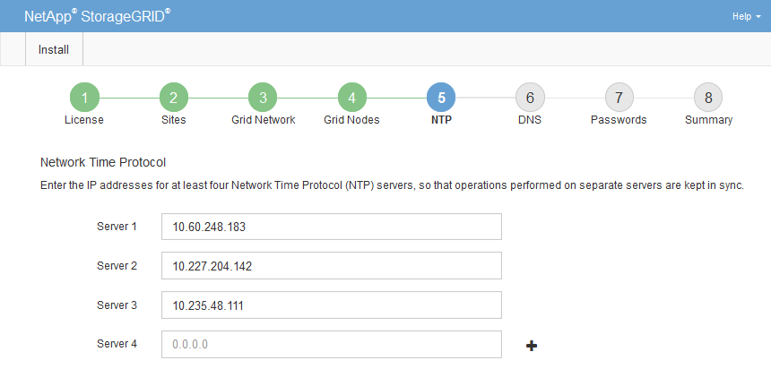

= Specifying Network Time Protocol server information
:icons: font
:imagesdir: ../media/

[.lead]
You must specify the Network Time Protocol (NTP) configuration information for the StorageGRID system, so that operations performed on separate servers can be kept synchronized.

.About this task

You must specify IPv4 addresses for the NTP servers.

You must specify external NTP servers. The specified NTP servers must use the NTP protocol.

You must specify four NTP server references of Stratum 3 or better to prevent issues with time drift.

[NOTE]
====
When specifying the external NTP source for a production-level StorageGRID installation, do not use the Windows Time (W32Time) service on a version of Windows earlier than Windows Server 2016. The time service on earlier versions of Windows is not sufficiently accurate and is not supported by Microsoft for use in high-accuracy environments, such as StorageGRID.

https://support.microsoft.com/en-us/help/939322/support-boundary-to-configure-the-windows-time-service-for-high-accura[Support boundary to configure the Windows Time service for high-accuracy environments^]
====

The external NTP servers are used by the nodes to which you previously assigned Primary NTP roles.

IMPORTANT: Make sure that at least two nodes at each site can access at least four external NTP sources. If only one node at a site can reach the NTP sources, timing issues will occur if that node goes down. In addition, designating two nodes per site as primary NTP sources ensures accurate timing if a site is isolated from the rest of the grid.

.Steps

. Specify the IPv4 addresses for at least four NTP servers in the *Server 1* to *Server 4* text boxes.
. If necessary, select the plus sign next to the last entry to add additional server entries.
+

. Select *Next*.

.Related information

xref:../network/index.adoc[Network guidelines]
